# Ciclo de Compras SIGEAC — Manual completo (usuario + desarrollador)

> Documento de referencia del ciclo completo: desde que alguien necesita algo hasta
> que ese algo sale del almacén y aparece costeado en un reporte.
>
> Cubre las dos familias que conviven en el sistema: **aeronáutica** (artículos con
> part number, lote, condición, documentos) y **general** (consumibles de oficina,
> insumos, herramientas menores). Son dos caminos distintos que comparten la misma
> cabecera de requisición, cotización y orden de compra, pero **divergen por completo
> en el momento de la recepción**.

---

## Índice

1. [Mapa mental en una página](#1-mapa-mental-en-una-página)
2. [Los cinco documentos del ciclo](#2-los-cinco-documentos-del-ciclo)
3. [Etapa 1 — Requisición (la solicitud)](#3-etapa-1--requisición-la-solicitud)
4. [Etapa 2 — Cotización](#4-etapa-2--cotización)
5. [Etapa 3 — Orden de compra](#5-etapa-3--orden-de-compra)
6. [Etapa 4 — El pago: aquí se bifurca todo](#6-etapa-4--el-pago-aquí-se-bifurca-todo)
7. [Etapa 5A — Recepción aeronáutica](#7-etapa-5a--recepción-aeronáutica)
8. [Etapa 5B — Recepción general (intakes)](#8-etapa-5b--recepción-general-intakes)
9. [Conversiones de unidad: el mecanismo transversal](#9-conversiones-de-unidad-el-mecanismo-transversal)
10. [Inventario: cómo se afecta realmente](#10-inventario-cómo-se-afecta-realmente)
11. [Despacho (salida) y el cierre del círculo](#11-despacho-salida-y-el-cierre-del-círculo)
12. [Costos: el hilo que atraviesa todo el ciclo](#12-costos-el-hilo-que-atraviesa-todo-el-ciclo)
13. [Manejo de discrepancias](#13-manejo-de-discrepancias)
14. [Reposición automática (low stock)](#14-reposición-automática-low-stock)
15. [Módulo supervisor: la válvula de escape](#15-módulo-supervisor-la-válvula-de-escape)
16. [Referencia de endpoints](#16-referencia-de-endpoints)
17. [Referencia de estados](#17-referencia-de-estados)
18. [Análisis: fortalezas, vulnerabilidades y faltantes](#18-análisis-fortalezas-vulnerabilidades-y-faltantes)

---

## 1. Mapa mental en una página

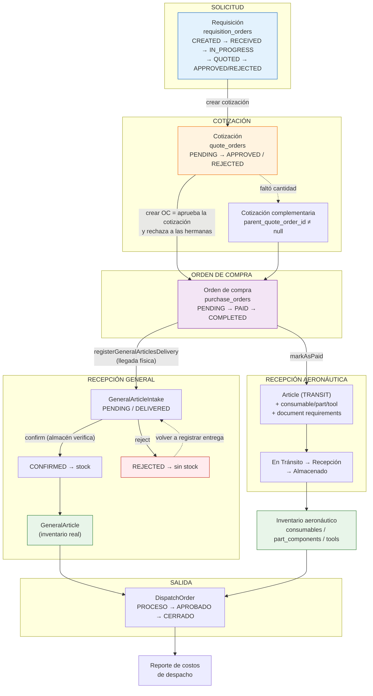

**La regla que explica casi todo el diseño:**

> El stock **nunca** se toca en la cadena documental. Requisición, cotización y orden
> de compra son papeles. El inventario solo cambia en dos puntos concretos:
> `markAsPaid` (aeronáutico, crea artículos en TRANSIT) y `confirm` del intake
> (general, incrementa `general_articles.quantity`).

---

## 2. Los cinco documentos del ciclo

| # | Documento | Tabla | Pregunta que responde | Toca inventario |
|---|-----------|-------|----------------------|-----------------|
| 1 | Requisición | `requisition_orders` | ¿Qué se **necesita**? | No |
| 2 | Cotización | `quote_orders` | ¿A qué **precio** y con quién? | No |
| 3 | Orden de compra | `purchase_orders` | ¿Qué se **compró** y cómo se pagó? | Sí (aeronáutico, al pagar) |
| 4 | Entrada / Intake | `general_article_intakes` | ¿Qué **llegó** físicamente? | Sí (general, al confirmar) |
| 5 | Salida | `dispatch_orders` | ¿Qué **se consumió**? | Sí (al aprobar) |

Cada documento tiene su tabla de ítems paralela, duplicada para aeronáutico y general:

| Cabecera | Ítems aeronáuticos | Ítems generales |
|----------|-------------------|-----------------|
| `requisition_orders` | `article_requisition_orders` | `general_article_requisition_orders` |
| `quote_orders` | `article_quote_orders` | `general_article_quote_orders` |
| `purchase_orders` | `article_purchase_orders` | `general_article_purchase_orders` |

Cada ítem apunta al ítem de la etapa anterior por FK directa
(`general_article_quote_orders.general_article_requisition_order_id`,
`general_article_purchase_orders.general_article_quote_order_id`). Eso significa que
**la trazabilidad ítem-a-ítem existe y es navegable en ambos sentidos**, no solo a
nivel de cabecera. Es la base de que la Nota de Entrega pueda mostrar el número de
la requisición original.

---

## 3. Etapa 1 — Requisición (la solicitud)

### Para el usuario

**Dónde:** `compras/requisiciones` (aeronáutica) o `compras/requisiciones_generales`
y `general/requisiciones` (general).

Se llena una cabecera (quién solicita, para qué aeronave / departamento / orden de
trabajo, justificación, prioridad) y una lista de ítems. Cada ítem tiene su propia
prioridad, cantidad, unidad, y opcionalmente una foto.

**Los dos tipos son excluyentes por requisición** (`type`: `AERONAUTICAL` o `GENERAL`),
y el correlativo se lleva por separado: `-A` y `-G`. En compañías donde
`isOMAC = false` no existe el mundo aeronáutico, así que se omite el sufijo.

**Ciclo de vida de la requisición:**

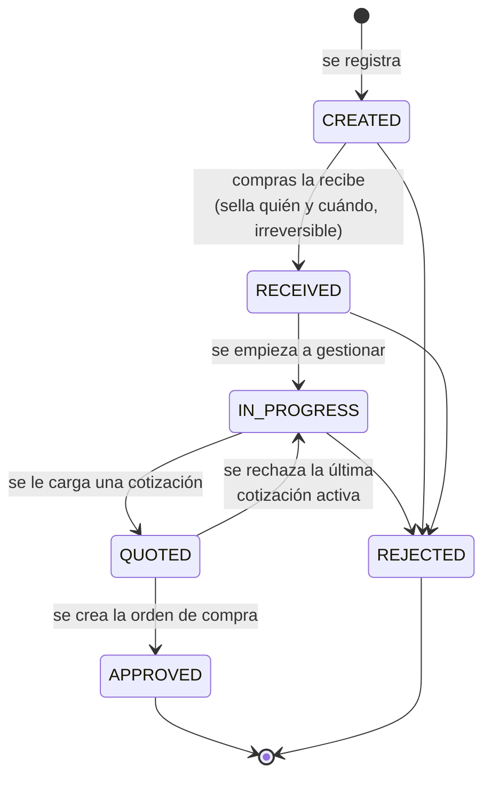

Estados de cada **ítem**: `PENDING` → `APPROVED` / `PARTIAL` / `REJECTED`. No los
pone el usuario a mano en el flujo normal — los calcula el sistema al crear la orden
de compra (ver §5).

### Para el desarrollador

**Archivos:** [RequisitionOrderController.php](../../../laragon/www/SIGEAC_Backend/app/Http/Controllers/Purchase/RequisitionOrderController.php),
[RequisitionOrder.php](../../../laragon/www/SIGEAC_Backend/app/Models/Purchase/RequisitionOrder.php)

Puntos técnicos que importan:

- **`markAsReceived()` es la única transición con guarda dura** en el modelo: solo
  dispara desde `CREATED` y sella `received_by`/`received_at` de forma permanente.
  El resto de transiciones se validan en el controlador (`RECEIVED → IN_PROGRESS`) o
  no se validan en absoluto.
- **Los ítems se insertan en bulk** (`array_chunk` de 100, límite de 2100 parámetros
  de SQL Server), construyendo cada fila vía el modelo para conservar mutators. Esto
  se hizo porque requisiciones grandes superaban el `request_terminate_timeout` de
  120 s de php-fpm y la transacción moría sin commit.
- **Las imágenes se escriben a disco DESPUÉS del commit** (`$pendingImageWrites`).
  I/O de archivos dentro de una transacción SQL Server mantenía locks abiertos de más.
- **Los correos y notificaciones también van después del commit**, para no dejar un
  correo "fantasma" con un número de orden que el rollback borró.
- `requested_by` es NOT NULL a nivel de BD: si solo llega
  `requested_by_authorized_employee_id`, el DNI se deriva server-side.

---

## 4. Etapa 2 — Cotización

### Para el usuario

**Dónde:** `compras/cotizaciones` o `compras/cotizaciones_generales`.

Se parte de una requisición y se cotizan sus ítems. Por cada ítem se registra
proveedor (`vendor`, aeronáutico) o comercio (`retailer`, general), precio unitario,
cantidad realmente ofertada, marca/modelo, tiempo de entrega y referencia.

**Un ítem se puede marcar `is_not_quoted`** cuando el proveedor no lo ofrece. Eso
exige justificación y, al crear la orden de compra, deja el ítem de la requisición
en `REJECTED` con esa misma justificación copiada.

Se pueden cargar **varias cotizaciones sobre la misma requisición** (una por
proveedor, para comparar). Solo una sobrevive: al crear la orden de compra desde una,
**las demás se rechazan automáticamente**.

### Cotización complementaria

Es la pieza más particular del diseño. Sirve para cuando **llegó más de lo que la
cotización amparaba** — por ejemplo, la cotización cubría 6 unidades pero el
comprador trajo 24.

La regla de negocio de fondo es: **un documento pagado nunca se edita ni se borra**.
En vez de corregir la cotización original, se crea una complementaria que documenta
la diferencia, con su propia justificación obligatoria, y que recorre el pipeline
completo (aprobación → pago → entrega → intake → confirmación).

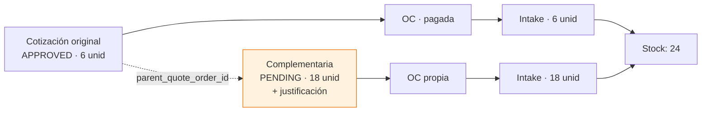

Reglas que hace cumplir el código:

- Solo sobre una cotización **`APPROVED`**.
- **No se puede complementar una complementaria** (se complementa la original).
- Al aprobarse, **no rechaza a sus hermanas** — no compite con nadie.
- Al aprobarse, **no re-sincroniza los estados de la requisición** — la requisición
  ya quedó fijada por la cadena original, y volver a sincronizar marcaría `REJECTED`
  los ítems que sí quedaron bien.
- Hereda del ítem padre todo lo descriptivo (retailer, unidad, marca, referencia):
  documenta *más cantidad del mismo artículo*, no un artículo distinto.

### Para el desarrollador

**Archivo:** [QuoteOrderController.php](../../../laragon/www/SIGEAC_Backend/app/Http/Controllers/Purchase/QuoteOrderController.php)

- **`APPROVED` no es una acción manual.** El endpoint `updateStatus` solo acepta
  `PENDING` y `REJECTED`. La aprobación ocurre exclusivamente dentro de
  `approveQuote()`, invocado por `PurchaseOrderController::store()`. Es una decisión
  de diseño fuerte: *no existe cotización aprobada sin orden de compra*.
- Al **rechazar** una cotización, la requisición vuelve a `IN_PROGRESS` y sus ítems
  se revierten (`rollbackRequisitionArticles`) **solo si no queda ninguna otra
  cotización activa**.
- El auto-rechazo de hermanas filtra por `whereNull('parent_quote_order_id')`, que es
  lo que deja las complementarias fuera de la competencia.

---

## 5. Etapa 3 — Orden de compra

### Para el usuario

**Dónde:** `compras/ordenes_compra` / `compras/ordenes_compra_generales`.

Se selecciona una cotización y los ítems a comprar. El sistema **puede generar más
de una orden de compra de una sola cotización**:

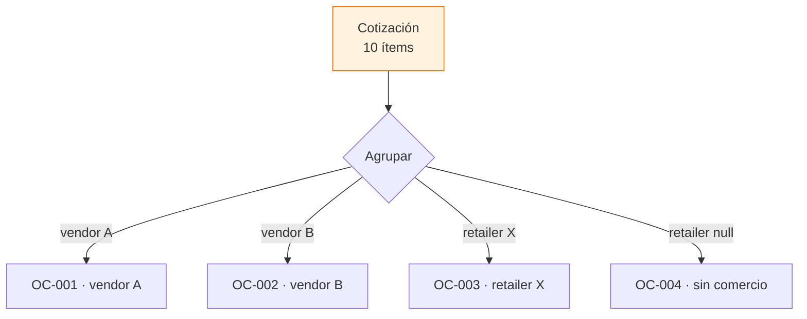

Porque una orden de compra solo puede tener **un** proveedor. Los aeronáuticos se
agrupan por `vendor_id`, los generales por `retailer_id`, y cada OC totaliza
**solo sus propios ítems**, no el total de la cotización.

Al crear la orden de compra pasan tres cosas de golpe:

1. La cotización pasa a `APPROVED` y sus hermanas a `REJECTED`.
2. Los ítems de la requisición se sincronizan: `APPROVED` (cantidad cotizada = pedida),
   `PARTIAL` (distinta), `REJECTED` (`is_not_quoted` o ausente de la cotización).
3. La requisición pasa a `APPROVED`.

Después se registra el pago: método, cuenta bancaria, tarjeta, facturas, fletes
(`shipping_fee`, `wire_fee`, `handling_fee`), agencia de envío, tracking.

Una compra puede llegar con **varias facturas** — el proveedor factura por partes, o
el envío y la mercancía vienen en documentos distintos. Se cargan todas, cada una con
su propio número y su archivo (PDF o imagen). Al completar la orden se pueden agregar
las que falten, corregir el número de una ya cargada, reemplazar su archivo o quitarla.

### Para el desarrollador

**Archivo:** [PurchaseOrderController.php](../../../laragon/www/SIGEAC_Backend/app/Http/Controllers/Purchase/PurchaseOrderController.php)

Detalle importante de arquitectura multi-tenant: las relaciones de pago
(`paymentMethod`, `bankAccount`, `bankCard`) apuntan a **`sigeac_master`**, no al
tenant. Los modelos referenciados fijan esa conexión, así que funcionan aun cuando la
orden vive en la BD del tenant. El banco no se relaciona directo — ya viene dado por
la cuenta.

La sincronización de estados de requisición (`syncRequisitionArticleStatuses`) compara
contra la **cantidad de la cotización** (lo que el proveedor ofreció), no contra lo
que finalmente se pagó.

Las facturas viven en `purchase_order_invoices` (una fila por factura: `invoice_number`
+ `file_path`), no en columnas de `purchase_orders` — las viejas `invoice` /
`invoice_number` se migraron a esa tabla y se eliminaron. El formulario envía el
**estado completo** de las facturas: `syncPurchaseOrderInvoices` borra las que no
lleguen en `kept_invoice_ids`, actualiza las que traen `id` y crea el resto. El
marcador `invoices_present` distingue "no envié facturas" de "las quité todas", que
en multipart se ven igual.

> **El disco se toca fuera de la transacción.** `syncPurchaseOrderInvoices` no borra
> ningún archivo: devuelve `[obsoletos, subidos]` y `update()` los resuelve según el
> desenlace — los obsoletos tras el commit (si revierte, las filas vuelven y deben
> seguir apuntando a un archivo existente) y los recién subidos en el `catch` (sin
> fila que los referencie). `Helper::transactional` sí hace rollback real, y el
> `findOrFail` de las líneas generales puede dispararlo.

La FK `purchase_order_id` es `ON DELETE CASCADE` **a propósito**: `QuoteOrderController
::destroy` borra la cotización y deja que la BD arrastre sus órdenes de compra, así que
sin cascada esa FK bloquearía el borrado de cualquier orden con facturas. La contrapartida
es que la cascada no borra archivos: los recogen antes `QuoteOrderController::destroy`,
`RequisitionOrderController::destroyRequisition`, `CascadeDeleteService`,
`PurchaseOrderController::destroy` y el comando `RemoveDuplicatePurchaseOrders`.

---

## 6. Etapa 4 — El pago: aquí se bifurca todo

Este es el punto de divergencia más importante del sistema, y la fuente número uno de
confusión al leer el código por primera vez.

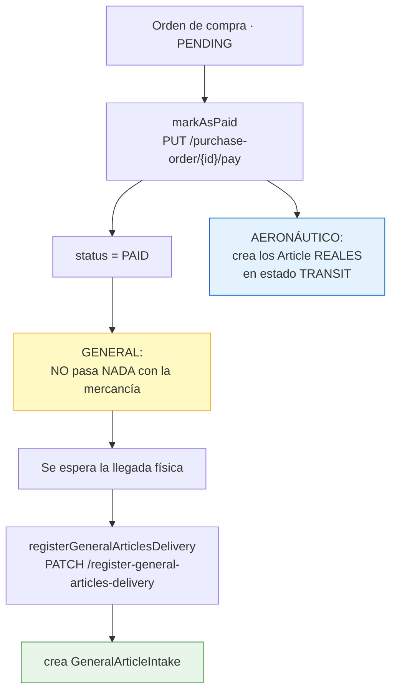

**Aeronáutico:** pagar equivale a que el artículo ya existe en el sistema. Se crean
las filas de `articles` en estado `TRANSIT`, más su especialización
(`consumable` / `part_component` / `tool` según la categoría del lote), más los
`ArticleDocumentRequirement` derivados de los tipos de documento que la requisición
exigía, más un movimiento de auditoría.

**General:** pagar **no** implica que la mercancía llegó. Alguien fue, la compró, y la
tiene que traer. El responsable llama explícitamente a
`registerGeneralArticlesDelivery` cuando la trae físicamente.

La razón de la asimetría es real: los aeronáuticos se compran a proveedores formales
con envío rastreable (por eso hay estado TRANSIT y tracking), mientras que los
generales típicamente los compra alguien de la empresa en un comercio local.

**`COMPLETED`** es la última revisión, ya conocidos todos los datos de la orden.
Se marca manualmente y no dispara ningún efecto sobre inventario.

---

## 7. Etapa 5A — Recepción aeronáutica

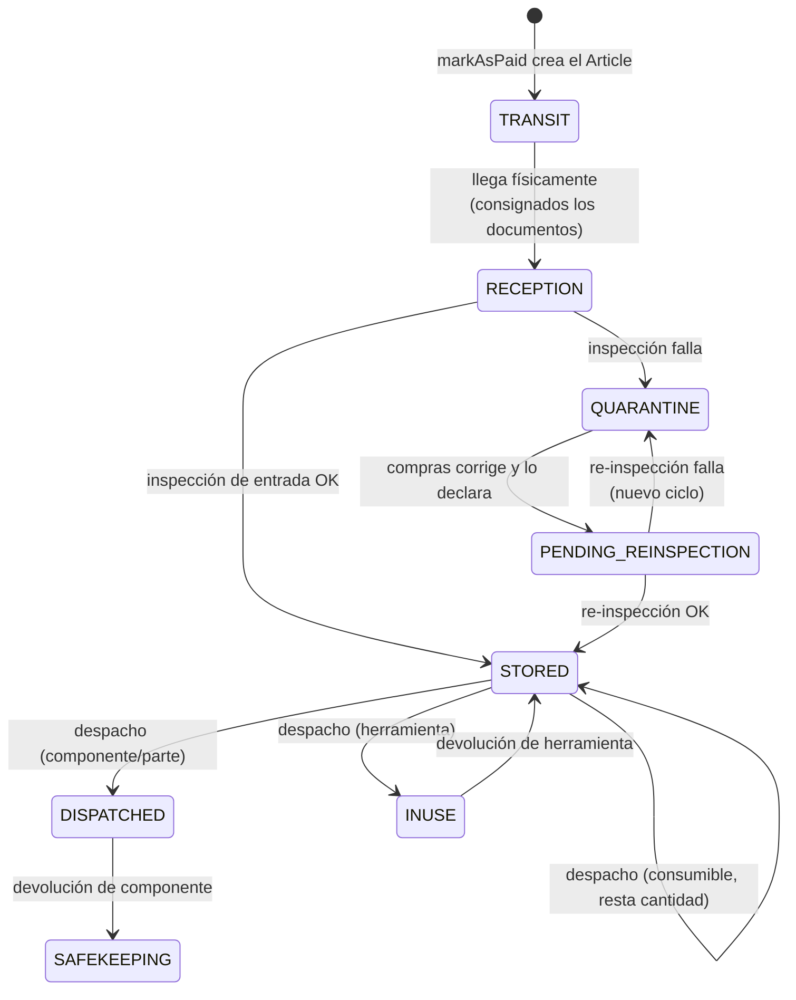

Pantallas involucradas: `compras/en_transito`, `almacen/ingreso/en_recepcion`,
`almacen/recepcion_administrativa`, `ingenieria/confirmar_inventario`,
`compras/destino_indeterminado`, `compras/cuarentena`,
`control_calidad/cuarentena`.

El artículo aeronáutico arrastra requisitos documentales (`article_documents`,
`article_document_requirements`, `article_document_types`) que se materializan en
`markAsPaid` desde lo que la requisición exigía, y se consignan antes de pasar el
artículo a RECEPTION.

En el incoming (`control_calidad/incoming/{id}`), junto a esos documentos se listan
las **facturas de la orden de compra** que originó el artículo: el inspector contrasta
la mercancía contra lo facturado sin salir de la pantalla. Llegan en
`purchase_order_invoices` dentro del `show` del artículo, y se sirven por `files/serve`
(disco `private`), no por el endpoint de documentos de artículo.

> **La factura en el incoming es de solo consulta.** Se abre en el `SecureFileViewer`
> (sin toolbar de descarga ni impresión, con los atajos de guardado bloqueados) y no
> tiene botón de descarga: el inspector la revisa, no la manipula ni se la lleva. Quien
> necesite el archivo lo descarga desde Compras, donde el botón sí existe. Ojo: es un
> bloqueo de UI, no del endpoint — `files/serve` sigue sirviendo el archivo a cualquier
> usuario autenticado que arme la petición a mano.

### El formato H74-036: emisión, historial y corrección

El artículo que aprueba la inspección queda en `WAITING_FOR_FORM` hasta que se
imprime el formato de recepción. Se emite desde la pestaña homónima de
`control_calidad/incoming` seleccionando los artículos y confirmando el diálogo;
al generarse, pasan a `WAITING_TO_LOCATE`.

**El número de orden que se imprime lo teclea el inspector.** El correlativo del
sistema (`PO2026JUL0001CBL-A`) no coincide con el que la empresa usa en papel, así
que el diálogo lo precarga como sugerencia pero deja editarlo. Es obligatorio: se
imprimía `N/A` cuando alguien lo dejaba vacío. Si los artículos seleccionados
vienen de varias OC distintas no se sugiere nada y se listan las involucradas.

Cada emisión deja fila en `incoming_inspections` con el PDF archivado en el disco
privado, bajo `documents/control_calidad/formatos/<año>/`. El nombre lleva un
sufijo aleatorio para que reimprimir la misma OC en la misma fecha no pise la
evidencia anterior.

**Corregir nunca edita el formato errado.** Emite uno nuevo que apunta al anterior
por `corrects_inspection_id` y deja el original en `issuance_status = VOIDED` con
motivo, autor y fecha. Ambos quedan en el historial y la cadena completa es
demostrable ante la OMAC. El diálogo de corrección precarga lo que decía el
formato anulado y exige el motivo.

El botón **Formatos emitidos**, junto al de generar, abre el historial: permite
buscar por número de orden, volver a descargar el PDF archivado y disparar la
corrección. Los anulados se muestran con su motivo y ya no ofrecen corregirse —
lo vigente es la última emisión de la cadena.

> **Una corrección no mueve inventario.** `markAsWaitingToLocate` se omite cuando
> viene `corrects_inspection_id`: el artículo ya siguió su curso (puede estar
> `STORED` y ubicado) y rehacer el papel no debe devolverlo a por-ubicar.

| Endpoint | Qué hace |
|---|---|
| `POST /{company}/incoming-format` | Emite; con `corrects_inspection_id` anula el anterior |
| `GET /{company}/incoming-formats` | Historial, filtrable por código de OC |
| `GET /{company}/incoming-formats/{id}/reprint` | Baja el PDF archivado tal cual se emitió |

> El PDF temporal sigue borrándose en `terminating()`; lo que persiste es la copia
> archivada. Antes no se guardaba ninguna de las dos, así que de un formato mal
> emitido no quedaba rastro alguno.

### El ciclo de cuarentena

Cuando la inspección de entrada (`incoming_inspections`) falla, el artículo pasa
a QUARANTINE y se abre un registro en `quarantine_articles`. **Sacarlo de
cuarentena es trabajo de compras, no de calidad**: el inspector describe el
hallazgo, pero quien corrige el documento faltante o el dato errado es
`JEFE_COMPRAS` / `ANALISTA_COMPRAS` desde `compras/cuarentena`.

Los tres estados del registro (`quarantine_articles.status`):

| Estado | Significado | Quién actúa |
|---|---|---|
| `OPEN` | Retenido, esperando corrección | Compras |
| `PENDING_REINSPECTION` | Corregido y declarado; el artículo queda en `PENDING_REINSPECTION` | Calidad |
| `RESOLVED` | Re-inspección aprobada; salió del ciclo | — |

El pase a re-inspección es **explícito** y de un solo gesto: el diálogo de
`compras/cuarentena` tiene un único botón, "Enviar a re-inspección", que guarda
lo que haya cambiado y a continuación avanza el ciclo. La nota de corrección es
obligatoria: es lo que el inspector verifica.

El diálogo embebe `RegisterArticleForm` completo —cada categoría necesita sus
propios campos (vida límite y hard time en componentes, lote y vencimiento en
consumibles, calibración en herramientas) y solo ese formulario los conoce.

Para que el botón viva en el footer del diálogo y no al final del formulario, el
formulario acepta `onStateChange`: con él oculta su propio bloque de acciones y
reporta `{ busy, canSave }` hacia arriba. El diálogo dibuja el botón fuera del
área desplazable y dispara el guardado con `requestSubmit()` sobre el `<form>`.
El rótulo distingue los dos casos sin partir la acción en dos botones:

| Estado | Botón |
|---|---|
| Nota escrita, artículo editado | Guardar y enviar a re-inspección |
| Nota escrita, sin cambios en el artículo | Enviar a re-inspección |
| Guardado, pero el pase falló | Reintentar envío a re-inspección |

**El guardado y el pase no comparten transacción.** El guardado del artículo son
N requests encadenados desde el cliente: `update-article`, un DELETE por
requerimiento a retirar, un POST para declarar tipos y un POST por documento. Es
así porque los archivos van en multipart y el id del requerimiento no se conoce
hasta que el backend lo crea. Para que eso no deje la corrección a medias:

- Antes de guardar se consulta `can-send-to-reinspection`. Si el registro ya no
  admite el pase (resuelto, inexistente), no se toca el artículo.
- Si el pase falla **después** de guardar, el diálogo no se cierra: avisa que los
  cambios ya quedaron guardados y el botón reintenta solo el pase.
- `send-to-reinspection` es idempotente: sobre un registro ya en
  `PENDING_REINSPECTION` devuelve 200 con el estado actual en vez de 409, para
  que un reintento tras una respuesta perdida no obligue a deshacer nada. No
  duplica el ciclo.

### El camino atómico (disponible, aún sin adoptar)

`POST /{company}/quarantine-articles/{id}/resolve` hace lo mismo en **un solo
request y una sola transacción**: actualiza el artículo (vía
`UpdateArticleAction`), consigna la documentación (vía
`ArticleDocumentSyncService`, que resuelve requerimientos y reemplazos sin
llamadas intermedias) y avanza el ciclo. Si algo falla, no queda nada guardado
— verificado forzando un fallo a mitad: el `part_number` volvió a su valor
original y el registro siguió en `OPEN`.

Es POST y no PATCH porque lleva archivos: PHP no puebla `$_FILES` en PATCH
multipart.

No lo usa nadie todavía. El diálogo embebe `RegisterArticleForm`, que guarda con
sus propios hooks, y adoptarlo exige desacoplar ese formulario. El servicio y el
endpoint quedan probados para cuando se haga.

El historial de intentos vive en la fila expandible del listado, no en el
diálogo: ahí compite con la corrección, que es a lo que se entra.

Cada ida y vuelta queda en `quarantine_article_cycles`: motivo del inspector →
corrección de compras → veredicto. Un rechazo abre un **ciclo nuevo sobre el
mismo registro**, no un registro nuevo, para que el plazo legal siga corriendo
desde la retención original y la reincidencia sea demostrable.

El plazo legal se configura por empresa en `company_settings.quarantine_legal_days`
(editable por SUPERUSER en `ajustes/empresa/operaciones`, 40 días por defecto).
Alimenta los días restantes de las vistas, la alerta crítica de compras y la
priorización del recordatorio diario (`quarantine:send-reminders`), que avisa por
correo lo vencido primero.

Ambos módulos ven los dos lados del ciclo — a compras le importa qué ya corrigió
y a calidad qué sigue trabado — pero la acción está acotada: el re-incoming solo
se ofrece sobre `PENDING_REINSPECTION`.

`PENDING_REINSPECTION` es un `articles.status` como cualquier otro, así que
aparece en el filtro de estados del inventario, en el historial de estados
(`STATUS_MOVEMENT_VERBS` lo reconoce por su verbo `PENDIENTE DE RE-INSPECCION`) y
tiene su propia pestaña en `control_calidad/incoming`. **No** es editable desde
almacén (`canModifyArticle`): durante el ciclo el artículo se corrige solo desde
compras, que registra qué cambió para que el inspector lo verifique.

### Avisos del ciclo

El ciclo notifica en las dos direcciones; ninguna de las dos puede tumbar la
operación que la origina (fallan a log, nunca revierten la transición):

| Cuándo | A quién | Canales |
|---|---|---|
| El inspector retiene (o rechaza una corrección) | Compras aeronáuticas + SUPERUSER | in-app + correo inmediato |
| Compras declara la corrección | Calidad (`JEFE_CONTROL_CALIDAD`, `INSPECTOR`) + SUPERUSER | in-app + correo inmediato |
| Diario 08:00 VET, lo que sigue `OPEN` | Compras | digest, vencidos primero |
| Semanal, lo que espera inspección | Calidad | digest que **incluye** `PENDING_REINSPECTION`, en bloque aparte |

El recordatorio semanal de incoming (`ArticleIncomingReminderService`) cuenta los
dos estados: un artículo en re-inspección olvidado cuesta más caro que un
incoming olvidado, porque su plazo legal de cuarentena sigue corriendo.

> **Cuidado al comparar `Article::status` en PHP**: el modelo tiene un accessor
> que lo devuelve en **minúsculas** aunque en BD esté en mayúsculas. Las
> consultas SQL no se ven afectadas, pero cualquier `$article->status === 'X'`
> debe normalizar con `strtoupper()`. `QuarantineArticle::status` no tiene ese
> accessor y se compara tal cual.

---

## 8. Etapa 5B — Recepción general (intakes)

Este es el subsistema más elaborado del ciclo y el más reciente.

### Los cuatro estados del intake

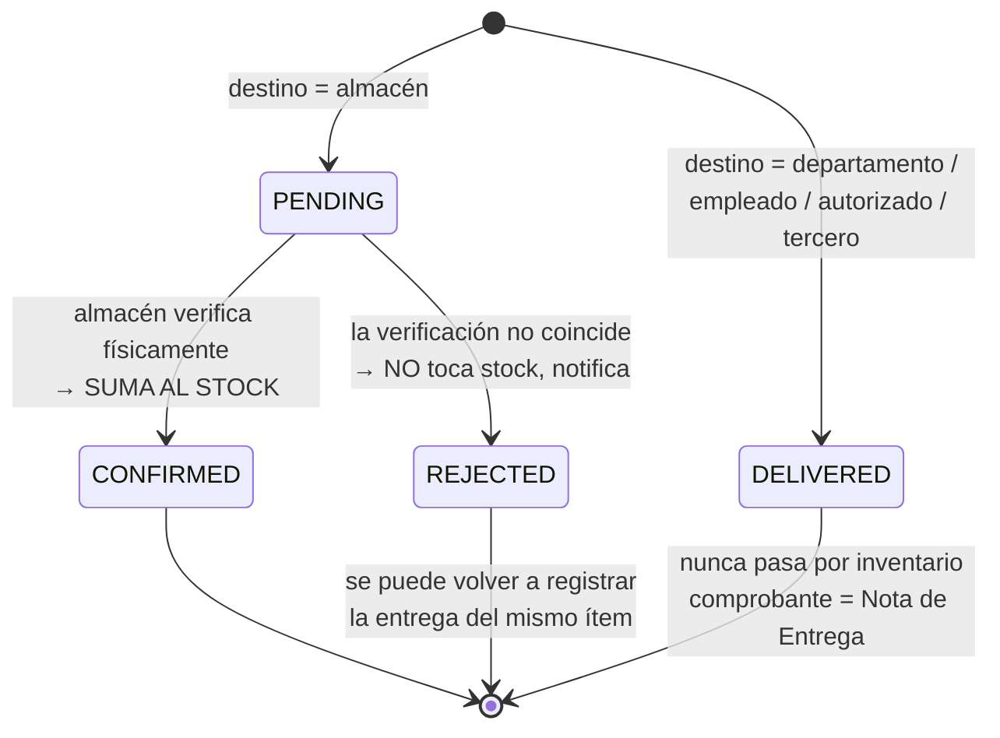

### Los dos destinos posibles

Al registrar la entrega se elige a dónde va la mercancía:

| Destino | Estado inicial | ¿Toca inventario? | Comprobante |
|---------|---------------|-------------------|-------------|
| Almacén (tipo `GENERAL`) | `PENDING` | Sí, al confirmar | Reporte de Recepción |
| Departamento / empleado / autorizado / tercero | `DELIVERED` | **Nunca** | Nota de Entrega (PDF) |

La entrega directa se detecta por `warehouse_id === null` (`isDirectDelivery()`).
El validador exige **a lo sumo un** destino directo, y si hay uno, exige `location_id`
para poder filtrar por estación.

**Consecuencia práctica importante:** una compra puede no aparecer nunca en
inventario y eso es correcto. Si el toner era para el departamento de Contabilidad y
se le entregó directo, no hay stock que gestionar — hay una Nota de Entrega firmada.

### La confirmación: el único punto donde nace el stock general

`GeneralArticleIntakeController::confirm()` es la operación más densa del módulo:

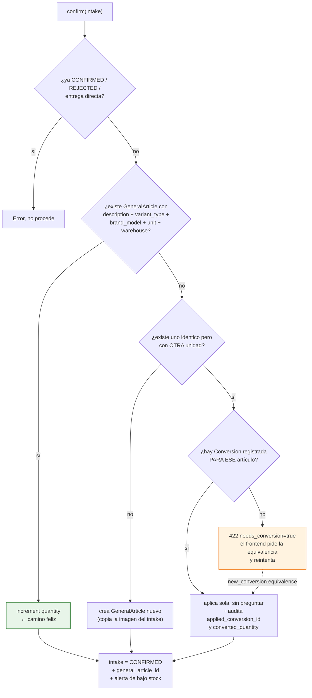

**El match de identidad excluye el costo a propósito.** Dos entregas del mismo
artículo a distinto precio son el mismo ítem físico, no dos productos.

**La identidad de un artículo general es `description + variant_type`** para efectos
de duplicados de compras; `brand_model` entra solo en el formulario y en el match
exacto de la confirmación.

`confirmationPreview` es un endpoint de solo lectura que el frontend llama al abrir el
diálogo, para saber de antemano si va a hacer falta pedir una equivalencia. Aplica
exactamente el mismo criterio que `confirm()`, así que no puede divergir.

### El rechazo

Cuando la verificación física no coincide (llegó otro artículo, otra cantidad), el
almacén rechaza con motivo obligatorio. El intake queda `REJECTED` como historial
permanente del incidente, **no toca el stock**, y se notifica in-app al responsable.

La cadena requisición → cotización → orden de compra **no se modifica**. El índice
único filtrado de `general_article_intakes` ignora los `REJECTED`, así que el
responsable puede volver a registrar la entrega del mismo ítem cuando resuelva la
discrepancia.

### Coherencia temporal de las fechas

Dos reglas de sentido físico en `GeneralArticleIntakeController::assertIntakeTimeline`,
con **alcances distintos**:

1. **Nada ocurre en el futuro** (`$againstClock`, solo en el registro y la confirmación
   reales). La mercancía se registra cuando ya está ahí, así que una `arrived_at`
   posterior a hoy solo puede ser un error de carga. Hacia atrás sí se permite:
   registrar hoy algo que llegó ayer es lo normal.
2. **Nada se verifica antes de llegar** (siempre). `confirmed_at` y `rejected_at` nunca
   pueden quedar por debajo de `arrived_at`, o el registro queda en un estado imposible.

La regla 1 **no aplica en la corrección**: ahí se arregla justamente un día mal
tecleado (pusieron 19 y era 20), y compararlo contra el reloj impediría la corrección.
La regla 2 sí se conserva siempre.

Hay un minuto de tolerancia contra el desfase de reloj entre navegador y servidor.
En el registro la regla 1 va además como validación (`before_or_equal`) en
`registerGeneralArticlesDelivery`.

### La corrección de una recepción (SUPERUSER)

`PATCH /{company}/general-article-intakes/{id}` — ruta normal del intake, restringida
a `SUPERUSER` por middleware. Nace del caso real de una llegada cargada con fecha
equivocada y confirmada con otra igual de mala, pero deja editar **todo** el registro:
identidad del artículo, cantidad, unidad, costo, almacén, fechas y notas.

Es una edición **parcial** (`sometimes`): viaja solo lo que cambió, y un `null`
explícito vacía un campo opcional. Las fechas se mueven libremente contra el reloj,
pero conservan el orden entre ellas, evaluado sobre el estado **resultante**, no sobre
lo enviado — mover la llegada hacia adelante choca con una confirmación vieja que
quede por detrás.

Lo importante: **si el intake ya estaba `CONFIRMED` y cambia lo que entró al
inventario** (cantidad, unidad o almacén), el stock del `general_article` se reajusta
en la misma transacción — se descuenta lo que esa entrada aportó y se suma lo nuevo,
auditado vía `GeneralArticleObserver::withContext`. Sin eso, la recepción diría una
cosa y el inventario otra. Al cambiar unidad o almacén se descarta la conversión
aplicada al confirmar: se calculó contra otra unidad base, y recalcularla exigiría
reemparejar el intake contra otro artículo, que ya es una reconfirmación.

El reajuste queda etiquetado como «Corrección de recepción (SUPERUSER)» en el historial
del artículo. Una entrega directa no puede convertirse en entrada de almacén ni al
revés: son flujos distintos, con y sin paso por inventario.

### Para el desarrollador — concurrencia

`createGeneralArticlesFromPurchaseOrder` tiene defensa en tres capas contra el doble
registro (doble clic, reintento):

1. `lockForUpdate()` sobre las filas de `general_article_purchase_orders` involucradas.
2. Chequeo de `alreadyRegisteredIds` (excluyendo `REJECTED`).
3. **Índice único filtrado en BD** (migración `2026_07_04_000000`) como resguardo
   definitivo, con `isUniqueConstraintViolation()` capturando el `23000`/`23505` y
   omitiendo el ítem silenciosamente en vez de reventar.

Ese es el patrón correcto y vale la pena replicarlo donde haga falta.

---

## 9. Conversiones de unidad: el mecanismo transversal

### El modelo

Una `Conversion` es un par de unidades + una equivalencia:

```
conversions
├── primary_unit    (FK units)
├── secondary_unit  (FK units)
└── equivalence     (float)
```

**La convención canónica** (definida en `ConversionController::getConversionArticles`):

> `equivalence` = cuántas `primary_unit` hace **1** `secondary_unit`.
>
> - Cantidad en `primary_unit` → `secondary_unit`: **dividir** por `equivalence`
> - Cantidad en `secondary_unit` → `primary_unit`: **multiplicar** por `equivalence`

Y una conversión se asocia a un artículo concreto vía tabla pivote:

- `general_articles_conversions` (artículo general ↔ conversión)
- `consumables_conversions` (consumible aeronáutico ↔ conversión)

**Esa asociación es crítica.** No basta con que exista una conversión entre dos
unidades: tiene que estar asociada al artículo. `findConversionBetween()` documenta
un bug ya corregido donde la falta de agrupamiento explícito del `OR` hacía que
Eloquent armara `WHERE (A) OR (B AND whereHas)` en vez de
`WHERE (A OR B) AND whereHas`, trayendo conversiones capturadas para otro artículo con
una equivalencia que no aplicaba.

### Dónde entran las conversiones en el ciclo

```mermaid
flowchart TD
    subgraph E["ENTRADA (confirmación de intake)"]
        E1["Se cotizó en CUARTO DE GALÓN<br/>el inventario maneja GALÓN"]
        E2["Se busca/crea la Conversion"]
        E3["converted_quantity = lo que<br/>realmente entra al stock"]
        E4["Queda auditado en<br/>applied_conversion_id"]
        E1-->E2-->E3-->E4
    end
    subgraph S["SALIDA (despacho)"]
        S1["Stock en LITRO,<br/>se despacha en MILILITRO"]
        S2["quantity = cantidad en unidad BASE<br/>(lo que se resta del stock)"]
        S3["converted_quantity = lo que<br/>realmente se entregó"]
        S1-->S2-->S3
    end
    subgraph C["COSTO (reporte)"]
        C1["costo declarado en CAJA,<br/>base es UNIDAD"]
        C2["costInBaseUnit: DIVIDE<br/>(inverso a la cantidad)"]
        C1-->C2
    end
```

**El detalle que más se malinterpreta:** en el despacho, `quantity` está en **unidad
base** (es lo que se resta del stock) y `converted_quantity` es lo **realmente
despachado** en la unidad de presentación. El total del reporte se ancla a la base;
la presentación muestra la unidad real.

**Y el inverso en costos:** convertir una *cantidad* de caja a unidad multiplica;
convertir un *costo* de caja a unidad **divide**. Más unidades → menor costo
unitario. `costInBaseUnit()` lo hace explícito.

---

## 10. Inventario: cómo se afecta realmente

### Los dos inventarios paralelos

| | Aeronáutico | General |
|---|---|---|
| Tabla base | `articles` | `general_articles` |
| Especialización | `consumables` / `part_components` / `tools` | ninguna |
| Cantidad | `consumables.quantity` (solo consumibles) | `general_articles.quantity` |
| Unidad | `consumables.primary_unit_id` | `general_articles.primary_unit_id` |
| Serializado | sí (part number, serial, condición) | no |
| Mínimo de stock | `batches.min_quantity` | `general_articles.minimum_quantity` |
| Máximo de stock | — | `general_articles.maximum_quantity` |
| Documentos | sí | no |

**`maximum_quantity` NO es un tope de existencia.** El inventario puede superarlo sin
problema. Es el **nivel objetivo de reposición**: el mínimo dispara la alerta, el
máximo dimensiona el pedido.

> mínimo 10, máximo 20, existencia 8 → se piden **12**

La cantidad sugerida **siempre se redondea al entero superior**, incluso con décimas
menores a 0,50 (5,01 y 5,70 dan igual **6**). Se pierde precisión a propósito: compras
cotiza sobre artículos que se venden por unidades enteras, y la cifra es una solicitud,
no una medición.

### Tabla de puntos de mutación

Esta es probablemente la tabla más útil del documento — cada lugar del sistema donde
una cantidad de inventario cambia:

| Operación | Archivo | Efecto |
|-----------|---------|--------|
| `markAsPaid` | `PurchaseOrderController` | crea `Article` en TRANSIT + especialización |
| `confirm` intake | `GeneralArticleIntakeController` | `increment('quantity')` o crea `GeneralArticle` |
| Despacho `APROBADO` | `DispatchOrderController::store` | resta de `consumables.quantity` / `general_articles.quantity` |
| `updateStatusDispatch` | `DispatchOrderController` | resta al aprobar un despacho en PROCESO |
| Eliminar despacho | `DispatchOrderController::destroy` | **devuelve** la cantidad al stock |
| Cascade delete | `CascadeDeleteService` | revierte el stock ya afectado |
| Fusión de duplicados | `GeneralArticleSupervisorController` | suma stock al superviviente, soft-delete del absorbido |

Cualquier funcionalidad nueva que toque cantidades tiene que entrar en esta lista y
disparar `LowStockAlertBroadcaster` **después del commit**.

---

## 11. Despacho (salida) y el cierre del círculo

### Para el usuario

**Dónde:** módulo de salidas de almacén.

Una salida (`DispatchOrder`, correlativo `SAL...`) puede mezclar artículos
aeronáuticos y generales en la misma solicitud. Se registra para quién
(departamento, aeronave, orden de trabajo, tercero) y con qué justificación.

Estados: `PROCESO` → `APROBADO` / `RECHAZADO` → `CERRADO` (al devolver).

El efecto sobre el artículo depende de su naturaleza:

| Categoría | Al aprobar la salida |
|-----------|---------------------|
| Consumible | resta cantidad, el artículo sigue `ALMACENADO` |
| Herramienta | pasa a `EN USO` (vuelve a `ALMACENADO` al devolverse) |
| Componente / parte | pasa a `DESPACHADO` (vuelve a `RESGUARDO` al devolverse) |
| Artículo general | resta cantidad de `general_articles` |

### Para el desarrollador

**Archivo:** [DispatchOrderController.php](../../../laragon/www/SIGEAC_Backend/app/Http/Controllers/Warehouse/Aeronautical/DispatchOrderController.php)

Dos utilidades que existen por razones muy concretas de SQL Server y que conviene
respetar:

- **`toDecimalString()`**: liga valores a columnas `decimal`/`numeric` como string con
  punto, independiente del locale. Si se liga un float de PHP y `LC_NUMERIC` usa coma,
  el binding produce `"1,5"` y SQL Server lanza *"Error converting data type nvarchar
  to numeric"*.
- **`normalizeQuantity()`**: acepta enteros, floats o strings con coma decimal.

`broadcastLowStockForTouchedArticles()` se llama **fuera** de la transacción, con los
IDs acumulados por referencia durante ella. Mismo patrón que el resto del sistema.

---

## 12. Costos: el hilo que atraviesa todo el ciclo

El costo es el hilo que atraviesa **todo** el ciclo: nace en la cotización, se
congela en el intake, se deriva en el inventario, se reinterpreta en la fusión y se
consume en el reporte de despacho. Esta sección lo sigue de punta a punta, porque
mirando cada pieza por separado no se entiende.

### 12.1 El recorrido completo del precio

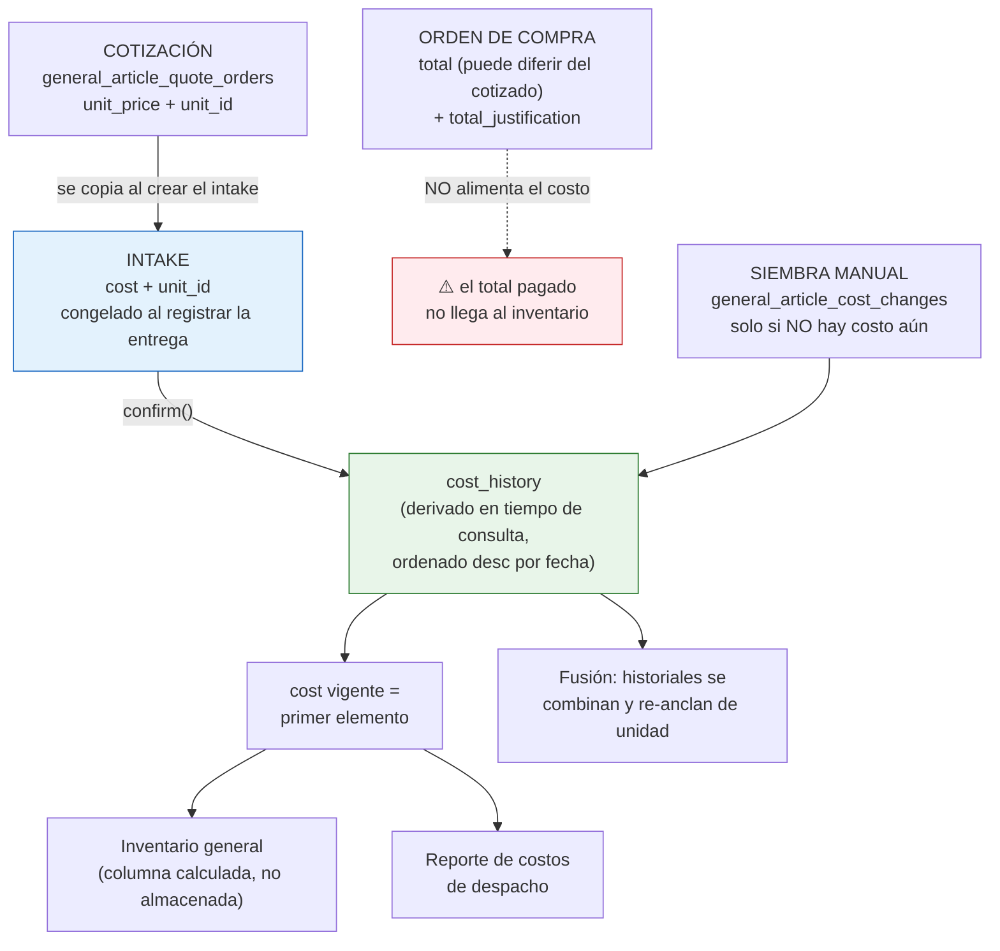

### 12.2 De dónde sale cada precio

`general_articles` **no tiene columna `cost`**. Fue eliminada. El precio vigente se
arma en `buildCostHistory()` combinando dos fuentes, cada una con **su propia unidad**:

| Fuente | Tabla | Campo | Fecha | `source` |
|--------|-------|-------|-------|----------|
| Compra confirmada | `general_article_intakes` | `cost` | `confirmed_at` | `PURCHASE` |
| Siembra / ajuste manual | `general_article_cost_changes` | `new_cost` | `changed_at` | `SEED` / `MANUAL` |

Se concatenan, se ordenan **desc por fecha**, y el costo vigente es simplemente el
primer elemento. Si no hay ninguno: `0`.

**Consecuencias que no son obvias:**

- El costo **solo se registra en intakes `CONFIRMED`** — el eager load filtra por ese
  estado. Un intake `PENDING` no aporta precio, y una **entrega directa
  (`DELIVERED`) nunca aporta precio a ningún inventario**, porque no hay artículo al
  cual asociarlo. Ese gasto existe en la orden de compra pero es invisible desde el
  inventario.
- Como el historial se deriva por fecha, **una compra vieja registrada tarde puede
  pisar el precio vigente** si su `confirmed_at` es posterior.
- El historial **sobrevive al borrado del artículo**: `GeneralArticle` usa
  `SoftDeletes` precisamente para que intakes y cost changes no queden huérfanos.

### 12.3 La regla de la siembra: el precio no se edita

Esto es lo que más sorprende al usar el módulo de Gestión de Costos:

> `updateCost` **solo puede sembrar el precio inicial** cuando el artículo todavía no
> tiene ninguno (costo derivado = 0). Si ya existe un precio, responde **422**:
> *"Solo se puede modificar mediante una nueva entrega de compra."*

Es la misma filosofía de inmutabilidad de §13 aplicada al precio: una vez que hay un
costo, el único modo legítimo de cambiarlo es **comprando otra vez**. `bulkUpdateCost`
hace lo mismo en lote y devuelve un array `skipped` con los IDs que ya tenían precio.

La siembra ancla el costo a `primary_unit_id` del artículo — sin eso el precio sería
ambiguo y no se podría reinterpretar al fusionar.

### 12.4 Costo en el reporte de despacho

`resolveGeneralArticleCostAt()` busca el costo vigente **a la fecha del despacho**
(no el de hoy), con esta prioridad:

1. El registro más reciente con fecha ≤ la del despacho (el realmente vigente).
2. Si no hay ninguno anterior pero sí posterior: el más antiguo, como mejor
   aproximación disponible (mejor esa referencia que $0).
3. Si no hay absolutamente ningún registro: $0 y **se marca la fila para revisión
   manual**.

Cada candidato pasa antes por `costInBaseUnit()`, que convierte el costo desde la
unidad en que se registró a la unidad base del artículo. Recordar la asimetría de §9:
**la cantidad multiplica, el costo divide**.

> $9 por CAJA, con 1 CAJA = 100 UNID → **$0.09 por UNID**

Si no hay conversión registrada entre ambas unidades, devuelve el costo crudo: mejor
el dato sin convertir que una conversión inventada.

### 12.5 Costo en la fusión de artículos

La fusión (§15) es donde el costo se pone verdaderamente delicado, y el código lo
trata con cuidado:

- Los historiales de todos los artículos se **combinan y reordenan por fecha**.
- Cada entrada se **re-ancla a la unidad final** vía `costEntryInBaseUnit()`.
- El endpoint de previsualización devuelve un `cost_summary` con
  **`current` vs. `resulting`**, más `resulting_from_article_id`.

Ese último punto es importante: **el costo vigente puede cambiar sin que el supervisor
lo pida**. Si un artículo absorbido trae una compra más reciente que la del
superviviente, ese precio pasa a mandar. El sistema lo expone explícitamente para que
no sea una sorpresa.

`projectCostChanges()` aplica las ediciones pendientes **en memoria** (no escribe
nada), de modo que lo que el supervisor ve en pantalla es exactamente lo que quedará
al confirmar.

### 12.6 ⚠️ El lado aeronáutico funciona al revés

Esta asimetría no está documentada en ningún lado del código y conviene tenerla muy
presente:

| | Artículo general | Artículo aeronáutico |
|---|---|---|
| Dónde vive el costo | derivado de intakes + cost changes | **columna `articles.cost`** |
| Unidad del costo | anclada (`unit_id` por registro) | **ninguna** |
| ¿Se puede editar? | **No** (solo siembra inicial) | **Sí, libremente y siempre** |
| Historial | completo, con fuente y fecha | solo un `Movement` de auditoría |
| Costo inicial | del intake al confirmar | `quoteArticle->unit_price` en `markAsPaid` |

`ArticleController::updateCost` **sobrescribe `articles.cost` sin ninguna restricción**
y deja únicamente un movimiento con el texto `"Actualización de costo: X → Y"`. El
valor anterior se pierde como dato estructurado — solo queda dentro de una cadena de
texto en la justificación del movimiento.

Es decir: todo el trabajo de rigor que se hizo en el mundo general (inmutabilidad,
unidad anclada, historial derivado, costo vigente a fecha) **no existe en el mundo
aeronáutico**, que es justamente el de los artículos más caros.

---

### Referencia rápida de endpoints de costo

| Método | Endpoint | Acción |
|--------|----------|--------|
| PUT | `/{company}/update-general-cost/{id}` | sembrar costo inicial (422 si ya tiene) |
| POST | `/{company}/bulk-update-general-cost` | siembra en lote, devuelve `skipped` |
| PUT | `/{company}/update-article-cost/{id}` | **sobrescribe** el costo aeronáutico |
| POST | `/{company}/bulk-update-article-cost` | sobrescritura en lote |
| GET | `/{company}/supervisor/general-articles/combined-cost-history` | historial combinado de un grupo |
| GET | `/{company}/supervisor/general-articles/{id}/timeline` | recorrido completo (ver §15) |

---

## 13. Manejo de discrepancias

Toda la filosofía se resume en una regla:

> **Los documentos pagados nunca se editan ni se borran.** Las discrepancias se
> documentan con papeles nuevos.

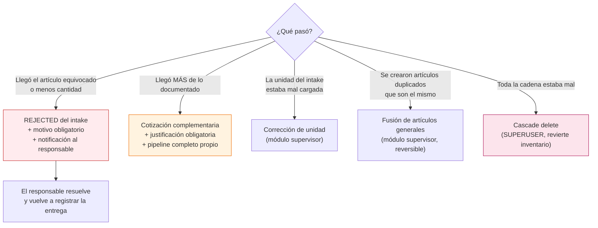

**Corrección de unidad:** del intake **solo** se edita la unidad. La corrección
propaga a la cotización y **se detiene ahí** — la requisición no se toca, porque
representa *lo que se solicitó*, no lo que se compró.

---

## 14. Reposición automática (low stock)

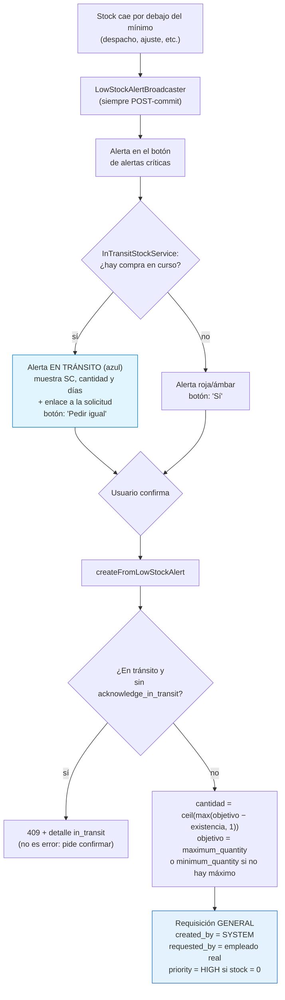

### El intervalo ciego entre aprobar y recibir

El inventario **solo sube cuando el intake se confirma**, pero la requisición pasa a
`APPROVED` mucho antes (al crearse la orden de compra). Medir "ya hay pedido en curso"
contra el status de la requisición dejaba un hueco: aprobada la solicitud, el artículo
seguía por debajo del mínimo y la alerta **reaparecía**, mientras el aviso de
`activeRequisitions` **desaparecía** — justo la combinación que llevaba a comprar dos
veces lo mismo.

`APPROVED` y `REJECTED` no son equivalentes aunque el código viejo los agrupara: en
`REJECTED` la alerta *debe* volver (nadie va a comprar eso); en `APPROVED` *no debe*,
porque ya viene en camino.

**`InTransitStockService` es el único dueño del criterio.** Una línea está en tránsito si:

1. la requisición sigue abierta (status distinto de `APPROVED`/`REJECTED`), **o**
2. fue aprobada, no ha vencido el TTL, y no existe todavía un intake `CONFIRMED`
   o `DELIVERED` recorriendo `requisición → cotización → OC → intake`.

`DELIVERED` liquida la línea sin sumar stock (entrega directa, nunca pasa por almacén).
`REJECTED` **no** liquida: esa mercancía no va a entrar, así que la línea sigue contando
como pendiente hasta que se re-entregue.

Detalles importantes:

- El match sigue siendo **por texto** (`description` + `variant_type`), no por
  `general_article_id`. Distintas marcas o unidades que comparten esos dos campos
  cuentan como *el mismo pedido*.
- **La alerta ya no se oculta**: el artículo en tránsito aparece en azul con la
  cantidad, los días de espera y la **solicitud de compra** que lo pidió. Ocultarlo
  era lo que permitía re-pedir a ciegas — quien iba a solicitar no veía nada.
- **La referencia visible es la SC, no la OC.** Almacén origina y sigue la solicitud;
  la orden de compra es un documento de compras que nunca llega a sus manos. La
  tarjeta enlaza a `/{company}/general/requisiciones/{order_number}` (el listado, si
  hay varias solicitudes en curso: apuntar a una sola sería arbitrario). El backend
  sigue exponiendo `purchase_order_number` en `in_transit` para quien lo necesite.
- **El contador del botón mide lo accionable, no el total.** Mostrar todo hacía que
  el número subiera por artículos ya comprados, y revisar la lista para descubrir que
  no había nada que hacer. El badge cuenta solo las alertas sin nada en camino y las
  ordena primero; si no queda ninguna, cae al número de las que vienen en camino y el
  botón pasa de rojo a azul (icono de camión), comunicando "hay stock bajo, pero ya
  está pedido". Sin alertas de ningún tipo el botón no se renderiza, como antes.
- **Filtro "Ocultar N en camino"**, en la cabecera del panel y persistido por usuario
  en `localStorage` (`criticalAlertsFilters`, ver `useAlertFiltersStore`). Solo aparece
  cuando hay algo que ocultar. Por defecto las de tránsito **se ven**: ocultarlas de
  entrada reintroduciría el bug corregido — quien va a pedir no vería que ya se compró.
  Es una salida voluntaria al ruido, no el comportamiento por defecto.
- **Caducidad (`purchase.in_transit_ttl_days`, por defecto 15 días).** Sin este tope,
  una requisición aprobada y luego abandonada silenciaría el artículo para siempre:
  cambiaríamos un falso positivo por un falso negativo, que es peor. Vencido el plazo,
  el artículo vuelve a alertar en rojo.
- **Re-pedir se advierte, no se bloquea.** Sin `acknowledge_in_transit` el backend
  responde `409` con el detalle; el frontend lo muestra y reintenta si el usuario
  confirma. Puede ser legítimo: lo comprado no alcanza, o urge y la compra se demora.
- El rechazo de un intake dispara `LowStockAlertBroadcaster`: reabre el tránsito y la
  alerta debe volver a sonar en el acto, sin esperar al refetch.
- `created_by = 'SYSTEM'` (la originó la alerta) pero `requested_by` es el empleado
  real que presionó el botón — la trazabilidad humana se conserva.
- El equivalente aeronáutico existe para consumibles, pero **usa
  `batches.min_quantity` y no tiene concepto de máximo**: repone solo hasta el mínimo.
  Su recepción no pasa por `general_article_intakes` sino por el status del propio
  `Article`, así que sobre él solo se aplica la regla de requisición abierta + TTL.
- `activeRequisitions` devuelve **un renglón por requisición y no un total**, porque
  las unidades pueden diferir entre ellas (1 GALÓN y 3 METRO del mismo artículo) y
  la suma no significaría nada. Ahora incluye también las aprobadas aún no recibidas.

---

## 15. Módulo supervisor: la válvula de escape

Módulo **solo para SUPERUSER**, con rutas propias
(`routes/api/supervisor`), pensado para sanear datos sin romper la trazabilidad.

**Fusión de artículos generales duplicados:**

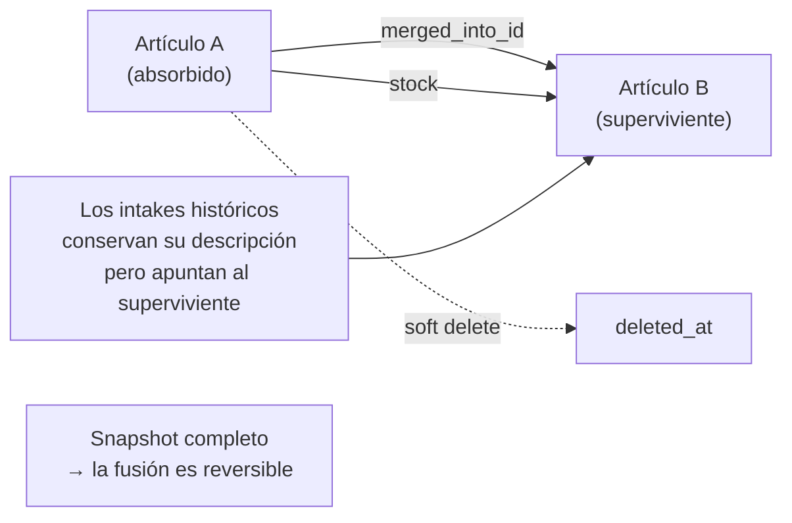

Los listados de Recepción muestran la identidad del **artículo vivo** (no la del
duplicado ya fusionado), con fallback al dato histórico del intake si el artículo no
existe. Ese criterio se aplica igual en pantalla y en el PDF.

También permite corregir unidades de intakes, con snapshot y reversión.

### Recorrido del artículo (timeline)

`GET /{company}/supervisor/general-articles/{id}/timeline` unifica en una sola línea
descendente cinco fuentes: ediciones auditadas (`AUDIT`), entradas de compra
(`INTAKE`), ajustes de costo (`COST`), despachos (`DISPATCH`) y fusiones (`MERGE`).

Es donde se responde **"¿esta compra se sumó al inventario, y cómo?"**:

- El evento `INTAKE` muestra `quantity` + `unit` (lo **comprado**) y, cuando la
  compra llegó en otra presentación, `converted_quantity` + `converted_unit` +
  `equivalence` (lo **realmente sumado al stock**, ya en la unidad base). Sin esos
  tres campos una entrada en unidad secundaria parecía no haber entrado.
- El evento `AUDIT` de la confirmación registra el `quantity` antes → después, con
  contexto `Entrada de compra · OC {n}`.

Ese `AUDIT` existe porque la confirmación **no** usa `increment()`: emite un UPDATE
directo que no dispara el evento `updating` de Eloquent, así que
`GeneralArticleObserver` no veía las entradas y el stock subía sin dejar rastro. Se
asigna y guarda el modelo para que quede auditado.

El rastro solo existe desde la puesta en marcha de `general_article_audit_logs`: las
confirmaciones anteriores no tienen evento `AUDIT` y no hay forma de reconstruirlo.
La conversión de esas entradas viejas sí se muestra, porque
`applied_conversion_id` / `converted_quantity` siempre se guardaron en el intake.

---

## 16. Referencia de endpoints

### Requisiciones
| Método | Endpoint | Acción |
|--------|----------|--------|
| GET | `/{company}/{location_id}/requisition-orders` | listado (acepta `?type=`) |
| GET | `/{company}/show-requisition-order/{order_number}` | detalle (con imágenes) |
| POST | `/{company}/requisition-order` | crear |
| POST | `/{company}/requisition-order/from-low-stock-alert` | crear desde alerta |
| PUT | `/{company}/requisition-order/{id}` | actualizar cabecera + ítems |
| PUT | `/{company}/requisition-order-update-status/{id}` | cambiar estado |
| PUT | `/{company}/requisition-order-update-priority/{id}` | cambiar prioridad |
| DELETE | `/{company}/delete-requisition-order/{id}` | eliminar |
| DELETE | `/{company}/requisition-order/{id}/cascade` | **SUPERUSER** — cascada |

### Cotizaciones
| Método | Endpoint | Acción |
|--------|----------|--------|
| GET | `/{company}/{location_id}/quotes` | listado |
| GET | `/{company}/show-quote/{quote_number}` | detalle |
| POST | `/{company}/quote` | crear |
| POST | `/{company}/quote/{id}/complementary` | crear complementaria |
| PUT | `/{company}/quote-order-update-status/{id}` | solo PENDING / REJECTED |
| DELETE | `/{company}/quote/{id}/cascade` | **SUPERUSER** — cascada |

### Órdenes de compra
| Método | Endpoint | Acción |
|--------|----------|--------|
| GET | `/{company}/{location_id}/purchase-orders` | listado |
| GET | `/{company}/purchase-orders/by-quote` | por cotización |
| POST | `/{company}/purchase-order` | crear (1..N según proveedor) |
| PUT | `/{company}/purchase-order/{id}/pay` | **PAID + crea artículos aeronáuticos** |
| PATCH | `/{company}/purchase-order/{id}/register-general-articles-delivery` | **crea intakes** |
| PUT | `/{company}/purchase-order/{id}/complete` | COMPLETED |
| DELETE | `/{company}/purchase-order/{id}/cascade` | **SUPERUSER** — cascada |

### Entradas de artículos generales
| Método | Endpoint | Acción |
|--------|----------|--------|
| GET | `/{company}/{location_id}/general-article-intakes` | listado (`?destination=warehouse`, `?status=`) |
| GET | `/{company}/{location_id}/general-article-intakes-pdf` | Reporte de Recepción General |
| GET | `/{company}/general-article-intakes/{id}/delivery-note-pdf` | Nota de Entrega |
| GET | `/{company}/general-article-intakes/{id}/confirmation-preview` | ¿hará falta conversión? |
| PATCH | `/{company}/general-article-intakes/{id}/confirm` | **confirma → suma stock** |
| PATCH | `/{company}/general-article-intakes/{id}/reject` | rechaza con motivo |

---

## 17. Referencia de estados

```
RequisitionOrder    CREATED · RECEIVED · IN_PROGRESS · QUOTED · APPROVED · REJECTED
  ítems             PENDING · APPROVED · PARTIAL · REJECTED

QuoteOrder          PENDING · APPROVED · REJECTED
                    (APPROVED solo vía creación de OC)

PurchaseOrder       PENDING · PAID · COMPLETED

GeneralArticleIntake PENDING · CONFIRMED · REJECTED · DELIVERED

DispatchOrder       PROCESO · APROBADO · RECHAZADO · CERRADO

Article (aeronáut.) TRANSIT · RECEPTION · STORED · DISPATCHED · INUSE · SAFEKEEPING · QUARANTINE
```

> ⚠️ Los nombres en inglés de los estados de cotización y orden de compra **no
> corresponden uno a uno con lo que sugieren sus nombres en español** en pantalla.
> Verificar siempre contra las constantes del modelo, no contra la etiqueta de la UI.

---

## 18. Análisis: fortalezas, vulnerabilidades y faltantes

Esta sección es una lectura crítica del código tal como está hoy. Distingo entre lo
que está sólido, lo que es riesgo real, y lo que falta.

### 18.1 Fortalezas reales

**Separación estricta papel/inventario.** Que el stock solo cambie en dos puntos
identificables es lo que hace auditable el sistema. Muchos ERP mezclan esto y se
vuelven imposibles de razonar.

**Post-commit disciplinado.** Correos, notificaciones, escritura de imágenes y
broadcasts de bajo stock se ejecutan sistemáticamente después del commit. Está
aplicado de forma consistente en requisiciones, intakes, despachos y cascade deletes,
y cada lugar documenta *por qué*. Es una de las cosas mejor hechas del código.

**Defensa en profundidad contra concurrencia en intakes.** `lockForUpdate` + chequeo
aplicativo + índice único filtrado + captura del error de duplicado. Es el patrón
correcto y está bien documentado.

**Inmutabilidad de lo pagado con salida documentada.** Las complementarias y el
rechazo de intake resuelven discrepancias sin editar documentos pagados. Es una
decisión de diseño madura, poco común, y correcta para un contexto donde hay
auditoría.

**Costo con unidad anclada e historial derivado.** Eliminar `general_articles.cost` y
derivar el precio de intakes + cost changes, cada uno con su unidad, resuelve de raíz
la ambigüedad de "$10 de qué". El fallback explícito a $0 con marca de revisión manual
es honesto.

**Trazabilidad ítem-a-ítem.** Se puede navegar desde una fila de inventario hasta el
ítem de la requisición que la originó. La Nota de Entrega usando el `order_number` de
la requisición en vez de un correlativo propio es un buen ejemplo de aprovecharlo.

**Comentarios que explican el porqué.** El código documenta decisiones no obvias y
bugs ya corregidos (el `whereHas` del OR, el locale en los decimales de SQL Server, el
timeout de php-fpm). Eso tiene valor real de mantenimiento.

---

### 18.2 Vulnerabilidades y riesgos

Ordenadas por severidad estimada.

#### 🔴 Alto — No hay control de stock negativo en el despacho

En `DispatchOrderController::store()`:

```php
$newQuantity = (float) $generalArticle->quantity - $quantity;
$generalArticle->update(['quantity' => $this->toFloatString($newQuantity)]);
```

No hay validación de que `$quantity <= $generalArticle->quantity`. Lo mismo para
consumibles. **Un despacho puede dejar el stock en negativo**, y con eso todos los
reportes de costo, las alertas de bajo stock y la reposición automática quedan
envenenados.

Tampoco hay `lockForUpdate` sobre la fila: dos despachos concurrentes del mismo
artículo pueden leer ambos la misma cantidad y restar sobre un valor obsoleto.

**Sugerencia:** bloquear la fila y validar disponibilidad dentro de la transacción,
con excepción clara al usuario. Ya existe el patrón hecho en los intakes.

#### 🔴 Alto — `updateStatusDispatch` opera sobre un solo artículo

```php
$dispatchArticle = DB::table('articles_dispatch_orders')
    ->where('dispatch_order_id', $id)->value('article_id');
```

`value()` devuelve **solo el primer** artículo. Pero `store()` permite crear despachos
con múltiples artículos aeronáuticos y generales. Si un despacho creado en `PROCESO`
con 5 ítems se aprueba por esta vía, **solo se descuenta el primero** y los generales
se ignoran por completo (la función ni los consulta).

Además usa `$dispatch->quantity` — una columna en la cabecera del despacho, no en el
pivote — que con múltiples ítems no tiene un significado claro.

**Sugerencia:** reescribir iterando `ArticleDispatchOrder::where('dispatch_order_id')`
igual que hace `destroy()`, que sí lo maneja bien.

#### 🟠 Medio-alto — `DispatchOrderController::update` sobrescribe cantidades

```php
ArticleDispatchOrder::where('dispatch_order_id', $id)
    ->update(['article_id' => $value['article_id'], ...]);
```

El `update` no filtra por la fila específica: **pone el mismo `article_id` en todas
las filas del despacho**. Y para consumibles hace
`Consumable::update(['quantity' => $quantity])` — asigna la cantidad del despacho
como si fuera el stock total, en vez de restar. Con un solo ítem quizá pase
desapercibido; con varios corrompe datos.

#### 🟠 Medio — El destino del despacho está hardcodeado

```php
$destination = Location::where('id', 2)->value('cod_iata');
```

El correlativo `SAL...` usa siempre la ubicación con `id = 2`, sin importar dónde se
esté operando. En un sistema multi-estación eso genera correlativos con el IATA
equivocado. El correlativo tampoco es atómico (`count()` + 1) — dos despachos
simultáneos pueden generar el mismo número.

Las requisiciones sí resuelven esto bien con `nextCorrelative()`; vale la pena
unificar.

#### 🟠 Medio — La orden de compra no valida contra lo cotizado

`store()` acepta un `total` arbitrario por ítem sin comparar con
`quoteArticle->total`, y `registerGeneralArticlesDelivery` crea el intake con
`quantity = $quoteArticle->quantity` sin permitir declarar que llegó menos.

La consecuencia es que la única vía para "llegó menos" es el rechazo completo del
intake, aunque el diseño reconoce el caso de "llegó más" con las complementarias. La
asimetría es notable: **hay mecanismo formal para el exceso pero no para el faltante
parcial**.

#### 🟡 Medio-bajo — Transiciones de estado sin guardas completas

Solo `CREATED → RECEIVED` y `RECEIVED → IN_PROGRESS` están validadas. `markAsPaid` no
verifica que la orden esté en `PENDING`: **llamarlo dos veces crea los artículos
aeronáuticos por duplicado**, porque `createArticlesFromPurchaseOrder` no tiene
chequeo de idempotencia (a diferencia de su equivalente general, que sí lo tiene con
el índice único).

`markAsCompleted` tampoco valida el estado previo, y ni siquiera abre transacción.

**Es el hueco más fácil de cerrar y de los más rentables:** una guarda de estado en
`markAsPaid` más un índice único en `articles(purchase_order_id, part_number)` o
equivalente.

#### 🟡 Medio-bajo — `getConversionArticles` usa una conexión construida a mano

```php
Conversion::on('sigeac_'.$company)
```

Varios métodos de `ConversionController` arman el nombre de la conexión concatenando,
en vez de usar la conexión `tenant` que el resto del sistema resuelve vía
`getConnectionNameForCompany()`. Si un tenant no sigue exactamente esa convención de
nombres, esos endpoints fallan mientras el resto funciona.

Además, `getConversionArticles` y `getConversionByConsumableUnit` **no filtran por
artículo**: devuelven cualquier conversión entre esas dos unidades. Es exactamente el
bug que `findConversionBetween()` corrigió en el flujo de intakes, pero sigue vivo
aquí.

#### 🟡 Bajo — `destroyRequisition` no borra los artículos generales

```php
ArticleRequisitionOrder::where('requisition_order_id', $id)->delete();
$requisitionOrder->delete();
```

Los `GeneralArticleRequisitionOrder` no se eliminan. Quedan filas huérfanas
apuntando a una requisición inexistente. Como el criterio de tránsito
(`InTransitStockService`) hace join contra `requisition_orders`, esas huérfanas no
bloquean nada, pero ensucian la base y pueden romper reportes.

#### 🟡 Bajo — `update()` del despacho y `store()` reasignan `$category`

En `store()`, `$category` se lee del request y luego se **sobrescribe** dentro del
loop de artículos aeronáuticos (`$category = $this->categoryArticle($batch_id)`).
El valor original ya se usó para calcular `submission_date`, así que no rompe hoy,
pero es una bomba de tiempo si alguien añade lógica después del loop.

#### 🟠 Medio — El costo aeronáutico no tiene ninguna de las garantías del general

Detallado en §12.6. `ArticleController::updateCost` sobrescribe `articles.cost` sin
restricción, sin unidad anclada y sin historial estructurado — el valor anterior
sobrevive solo dentro del texto de un `Movement`.

El mundo general recibió un rediseño completo (columna `cost` eliminada, historial
derivado, inmutabilidad, unidad por registro) que **nunca se aplicó al aeronáutico**,
donde están los artículos de mayor valor. Cualquiera con permiso puede cambiar el
costo de una parte de aeronave y no queda trazabilidad consultable de qué valor tenía
antes ni por qué cambió.

#### 🟠 Medio — El total realmente pagado nunca llega al inventario

El costo del intake se copia de `general_article_quote_orders.unit_price` (lo
**cotizado**), no de `general_article_purchase_orders.total` (lo **pagado**). Como
`store()` de la orden de compra acepta un `total` distinto al cotizado —con su
`total_justification`— hay un camino directo a que **el inventario valore la mercancía
a un precio que no es el que se pagó**.

El dato correcto existe en la base; simplemente no se propaga.

#### 🟡 Medio-bajo — El gasto de las entregas directas es invisible

Un intake `DELIVERED` nunca se asocia a un `general_article`, así que su `cost` no
entra en ningún historial ni en ningún reporte de inventario. Es dinero gastado que
solo se puede ver desde la orden de compra.

Si las entregas directas son un porcentaje relevante de las compras generales, los
reportes de costo por artículo están subrepresentando el gasto real de la compañía.

#### 🟡 Bajo — El constructor de `DispatchOrderController`

```php
public function __construct(private FilterDispatchInterface $filterDispatchInterface)
{
    $this->$filterDispatchInterface = $filterDispatchInterface;
}
```

`$this->$filterDispatchInterface` (con `$`) es **acceso a propiedad variable**: crea
una propiedad dinámica cuyo nombre es la representación string del objeto. No rompe
porque la promoción del constructor ya asignó la propiedad real, pero en PHP 8.2+
emite deprecation de propiedad dinámica y confunde a cualquiera que lo lea. Es un
typo puro: sobra el `$`.

---

### 18.3 Lo que falta

**Recepción parcial de artículos generales.** El caso "pedí 10, llegaron 7" no tiene
camino limpio: o se rechaza todo, o se confirman 10 que no llegaron. Dado que ya
existe la complementaria para el exceso, la simetría pide un mecanismo para el
faltante (declarar cantidad recibida al confirmar, dejando el resto pendiente).

**Devoluciones al proveedor.** Existe la devolución interna (herramienta/componente
que vuelve al almacén), pero no hay flujo para devolver mercancía defectuosa al
proveedor con su nota de crédito.

**Historial de estados.** Se guarda `updated_by` / `updated_at`, es decir **solo el
último cambio**. No hay tabla de transiciones. Reconstruir "cuándo pasó esta
requisición de IN_PROGRESS a QUOTED y quién lo hizo" es imposible hoy. Existen
`article_audit_logs` y `general_article_audit_logs` para artículos, pero nada
equivalente para los documentos de compra.

**Cierre real de la orden de compra.** `COMPLETED` es manual y no verifica que todos
los ítems tengan intake confirmado o artículo recibido. Una orden puede marcarse
completada con mercancía sin recibir.

**Presupuesto / aprobación por monto.** No hay control de límites de gasto ni cadena
de aprobación por umbral. Cualquiera con permiso de crear órdenes puede crear una de
cualquier monto.

**Tests.** No encontré cobertura automatizada del ciclo. Para lógica de esta densidad
—especialmente `confirm()` con sus cuatro ramas y las conversiones bidireccionales—
un puñado de tests de integración daría mucha tranquilidad al refactorizar.

**Métricas de proveedor.** Se guarda `lead_time` en la cotización pero no se compara
contra la fecha real de llegada (`arrived_at`). Los datos para medir cumplimiento de
proveedores ya están; falta el reporte.

---

### 18.4 Prioridades sugeridas

Si hubiera que ordenar el trabajo:

| Prioridad | Acción | Por qué |
|-----------|--------|---------|
| 1 | Validar stock disponible + `lockForUpdate` en despacho | Corrupción silenciosa de datos que envenena todos los reportes |
| 2 | Arreglar `updateStatusDispatch` para múltiples ítems | Descuentos de inventario que simplemente no ocurren |
| 3 | Guarda de estado + idempotencia en `markAsPaid` | Duplicación de artículos aeronáuticos |
| 4 | Revisar `DispatchOrderController::update` | Sobrescribe cantidades y article_id de todas las filas |
| 5 | Propagar el total **pagado** (no el cotizado) al costo del intake | El inventario valora a un precio que puede no ser el real |
| 6 | Correlativo de despacho: ubicación real + atómico | Correlativos incorrectos y colisiones |
| 7 | Llevar el rediseño de costos al mundo aeronáutico | Los artículos más caros son los menos controlados |
| 8 | Recepción parcial de generales | Hueco funcional con impacto diario |
| 9 | Historial de transiciones de estado | Requisito típico de auditoría |
| 10 | Tests de integración del ciclo | Habilita todo lo anterior con seguridad |

---

## Glosario

| Término | Significado |
|---------|-------------|
| **Requisición** | Solicitud de compra. Lo que se *necesita*. |
| **Cotización** | Oferta de precio de un proveedor sobre una requisición. |
| **Complementaria** | Cotización que documenta la diferencia cuando llegó más de lo amparado. |
| **Orden de compra (OC)** | Documento de la compra efectiva. Una por proveedor. |
| **Intake** | Registro de llegada física de un artículo general. |
| **Entrega directa** | Intake sin almacén: va a una persona/departamento, nunca entra a inventario. |
| **Vendor** | Proveedor formal (mundo aeronáutico). |
| **Retailer** | Comercio / lugar de compra (mundo general). |
| **Conversión** | Equivalencia entre dos unidades, asociada a un artículo concreto. |
| **Unidad base** | `primary_unit_id` del artículo: la unidad en que se lleva el stock. |
| **Lote (batch)** | Agrupación aeronáutica con categoría (consumible/componente/parte/herramienta) y mínimo de stock. |
| **isOMAC** | Flag de compañía: si es false, no existe el mundo aeronáutico. |
