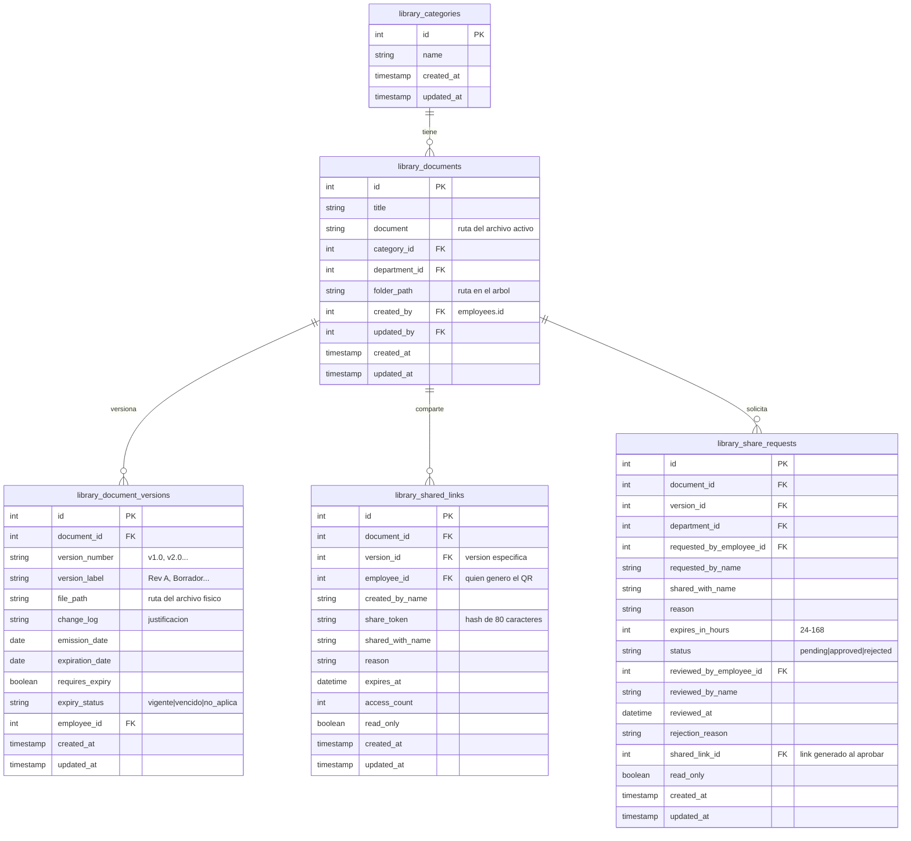

# Manual de Desarrollador — Biblioteca Digital

Fecha: 2026-05-26
Versión: 1.0

---

## 1. Introducción y Arquitectura General

### 1.1 Propósito

Este manual está dirigido a desarrolladores que se incorporan al proyecto SIGEAC (onboarding) y al equipo existente que necesita una referencia técnica diaria del módulo Biblioteca Digital.

**Lo que cubre:**
- Setup local del módulo (backend + frontend)
- Modelo de datos completo (entidades, relaciones, migraciones)
- Controladores, servicios y traits del backend
- Componentes y páginas del frontend
- Flujos de permisos y aislamiento por departamento

**Lo que NO cubre** (documentado en otros lugares):
- Flujos de usuario detallados → ver `SIGEAC_Frontend/docs/manual-biblioteca-digital.md`
- Decisiones de diseño específicas → ver `docs/superpowers/specs/` (6 specs)
- Diagramas de flujo → ver `docs/diagrams/` (5 diagramas)
- Descripción general de vistas → ver `SIGEAC_Backend/docs/superpowers/specs/2026-05-20-digital-library-views-description.md`
- Guía general del backend → ver `SIGEAC_Backend/CLAUDE.md`

### 1.2 Arquitectura del Módulo

```
┌─────────────────────────────────────────────────────────┐
│                     Frontend (Next.js 14)                │
│  app/[company]/general/biblioteca/                       │
│  components/library/ (13 componentes)                    │
│  lib/libraryService.ts (API client)                      │
│  hooks/useLibraryNotifications.ts (WebSocket)            │
└──────────────────────┬──────────────────────────────────┘
                       │ HTTP (Axios + Fetch)
                       ▼
┌─────────────────────────────────────────────────────────┐
│                  Backend (Laravel 11)                    │
│  LibraryController (977 loc)                             │
│  LibraryService (315 loc)                                │
│  3 Traits (permission, folder tree, URL helper)          │
│  5 Models + Global Scopes                                │
└──────────────────────┬──────────────────────────────────┘
                       │ Dynamic DB Connection
                       ▼
┌─────────────────────────────────────────────────────────┐
│              SQL Server (Multi-tenant)                   │
│  sigeac_transmandu.library_* (9 tablas)                  │
│  sigeac_hangar74.library_*                               │
└─────────────────────────────────────────────────────────┘
```

### 1.3 Aislamiento por Departamento

Cada documento pertenece a un departamento (`department_id`). El acceso se controla mediante **Global Scopes** en Eloquent:

- `LibraryDocument::booted()`: aplica `where('library_documents.department_id', $employee->department_id)`
- `LibraryDocumentVersion::booted()`: aplica `whereHas('document', ...)`

**Excepciones** (acceso completo):
- Usuarios con rol SUPERUSER, ADMIN, ADMINISTRADOR (`$user->isAdmin()`)
- Directores del departamento DIP (cargo contiene "director" + acrónimo del depto = "DIP")

### 1.4 Modelo de Permisos

Dos capas:

1. **Spatie Laravel Permission** — roles y permisos globales del sistema
2. **LibraryPermissionTrait** — lógica específica del módulo:
   - `checkUserPermission($user, $targetDepartmentId)`: requiere que el usuario sea director y pertenezca al mismo departamento
   - `isDipDirector($user)`: verifica cargo "director" + depto "DIP" (o isAdmin)
   - `userCanAccessDepartment($user, $departmentId)`: verifica pertenencia al departamento

### 1.5 Multi-tenencia

Cada empresa (tenant) tiene su propia base de datos SQL Server. El middleware `SetDynamicConnectionDB` cambia la conexión según el parámetro `{company}` en la URL. Las tablas de la biblioteca viven en la base de datos del tenant (ej. `sigeac_transmandu`).

### 1.6 Estructura de Archivos del Módulo

#### Backend (Laravel)

| Archivo | Propósito |
|---------|-----------|
| `app/Http/Controllers/General/LibraryController.php` | Controlador principal (977 líneas) |
| `app/Services/LibraryService.php` | Lógica de negocio (documentos, versiones, sharing) |
| `app/Models/General/LibraryCategory.php` | Categorías de documentos |
| `app/Models/General/LibraryDocument.php` | Documento principal con Global Scope |
| `app/Models/General/LibraryDocumentVersion.php` | Versiones de documentos con Global Scope |
| `app/Models/General/LibrarySharedLink.php` | Enlaces compartidos (QR) |
| `app/Models/General/LibraryShareRequest.php` | Solicitudes de compartición |
| `app/Traits/Library/LibraryPermissionTrait.php` | Lógica de permisos del módulo |
| `app/Traits/Library/LibraryFolderTreeTrait.php` | Manipulación del árbol de carpetas |
| `app/Traits/Library/LibraryUrlHelperTrait.php` | Construcción de URLs públicas |
| `app/Http/Requests/LibraryRequest.php` | Validación de upload/version |
| `routes/api/general/routes.php` | Definición de rutas (públicas y protegidas) |
| `database/migrations/2026_03_12_*` a `2026_05_14_*` | 9 migraciones del módulo |

#### Frontend (Next.js)

| Archivo | Propósito |
|---------|-----------|
| `app/[company]/general/biblioteca/page.tsx` | Página principal (569 líneas) |
| `app/[company]/general/biblioteca/DocumentTable.tsx` | Tabla de documentos |
| `app/[company]/general/biblioteca/UploadModal.tsx` | Modal de subida |
| `app/[company]/general/biblioteca/documentRow.tsx` | Fila individual de documento |
| `app/acceso_publico/shared-viewer/[company]/[token]/page.tsx` | Visor público vía QR |
| `components/library/FolderTree.tsx` | Árbol de carpetas con drag & drop |
| `components/library/SecureVisualizer.tsx` | Visor PDF seguro |
| `components/library/HistoryPanel.tsx` | Panel de trazabilidad |
| `components/library/ShareDialog.tsx` | Diálogo de compartir |
| `components/library/ShareRequestsPanel.tsx` | Panel de solicitudes |
| `components/library/VersionPanel.tsx` | Historial de versiones |
| `components/library/DashboardModal.tsx` | Dashboard estadístico |
| `components/library/CreateFolderDialog.tsx` | Crear carpeta |
| `components/library/RenameFolderDialog.tsx` | Renombrar carpeta |
| `components/library/DeleteFolderDialog.tsx` | Eliminar carpeta |
| `components/library/UploadVersionDialog.tsx` | Subir nueva versión |
| `components/library/DownloadDocumentDialog.tsx` | Confirmación de descarga |
| `components/library/DeleteDocumentDialog.tsx` | Confirmación de eliminación |
| `lib/libraryService.ts` | Cliente API (18 métodos) |
| `hooks/useLibraryNotifications.ts` | WebSockets para notificaciones |

---

## 2. Setup Local y Configuración

### 2.1 Requisitos Previos

- PHP 8.2+
- Composer
- Node.js 18+
- SQL Server (con extensión `pdo_sqlsrv` habilitada en PHP)
- Git

### 2.2 Backend

```bash
# 1. Clonar y entrar al backend
cd SIGEAC_Backend

# 2. Instalar dependencias
composer install

# 3. Configurar variables de entorno (copiar .env.example a .env)
#    Asegurar estas variables:
#    DB_CONNECTION_SQLSRV=sqlsrv
#    DB_HOST=localhost
#    DB_PORT=1433
#    DB_DATABASE=sigeac_transmandu
#    FRONTEND_URL=http://localhost:3000
#    FILESYSTEM_DISK=local

# 4. Ejecutar migraciones (el orden es automático)
php artisan migrate

# 5. Seeders necesarios
php artisan db:seed --class=LibraryCategorySeeder  # Categorías base
php artisan db:seed --class=DepartmentSeeder        # Departamentos

# 6. Iniciar servidor
php artisan serve
```

**Almacenamiento:** Los PDFs se guardan en `storage/app/companies/{company}/library/{department}/{document}/`. Asegurar que `storage/app` tenga permisos de escritura.

### 2.3 Frontend

```bash
# 1. Clonar y entrar al frontend
cd SIGEAC_Frontend

# 2. Instalar dependencias
npm install

# 3. Configurar .env.local
#    NEXT_PUBLIC_API_BASE_URL=http://localhost:8000/api

# 4. Iniciar servidor de desarrollo
npm run dev
```

### 2.4 Verificación

1. Abrir `http://localhost:3000/transmandu/general/biblioteca`
2. Iniciar sesión con un usuario que tenga acceso a Biblioteca Digital
3. Verificar que se cargan las categorías (ej. "Manuales", "Circulares")
4. Verificar que se listan los departamentos en el panel izquierdo
5. Subir un documento PDF de prueba
6. Verificar que aparece en la tabla de documentos
7. Abrir el visor para confirmar que el PDF se renderiza

---

## 3. Modelo de Datos

### 3.1 Diagrama Entidad-Relación



### 3.2 Migraciones (Orden Cronológico)

| Fecha | Archivo | Tabla | Propósito |
|-------|---------|-------|-----------|
| 2026-03-12 | `141024_create_library_categories_table` | `library_categories` | Categorías base |
| 2026-03-12 | `141049_create_library_documents_table` | `library_documents` | Documentos principales |
| 2026-03-20 | `135942_create_library_shared_links` | `library_shared_links` | Enlaces QR |
| 2026-03-25 | `173446_create_library_document_versions_table` | `library_document_versions` | Versionado |
| 2026-03-26 | `204119_add_dates_to_library_document_versions` | `library_document_versions` | Fechas emisión/vencimiento |
| 2026-05-14 | `000000_add_library_folder_structure` | `library_documents` + `departments` | `folder_path` + `library_folder_tree` |
| 2026-05-14 | `010000_add_version_label` | `library_document_versions` | `version_label` |
| 2026-05-14 | `020000_create_library_share_requests` | `library_share_requests` | Solicitudes de compartición |
| 2026-05-14 | `030000_add_read_only_to_library_shares` | `library_shared_links` + `library_share_requests` | `read_only` |

### 3.3 Relaciones Eloquent

#### LibraryDocument

| Relación | Tipo | Método | Descripción |
|----------|------|--------|-------------|
| Categoría | BelongsTo | `category()` | `belongsTo(LibraryCategory::class)` |
| Departamento | BelongsTo | `department()` | `belongsTo(Department::class)` |
| Versiones | HasMany | `versions()` | `orderBy('version_number', 'desc')` |
| Última versión | HasOne | `latestVersion()` | `latestOfMany()` — evita saturar memoria |
| Enlaces compartidos | HasMany | `sharedLinks()` | `hasMany(LibrarySharedLink::class)` |
| Creador | BelongsTo | `creator()` | `belongsTo(Employee::class, 'created_by')` |
| Actualizador | BelongsTo | `updater()` | `belongsTo(Employee::class, 'updated_by')` |

#### LibraryDocumentVersion

| Relación | Tipo | Método | Descripción |
|----------|------|--------|-------------|
| Documento | BelongsTo | `document()` | `belongsTo(LibraryDocument::class)` |
| Empleado | BelongsTo | `employee()` | `belongsTo(Employee::class)` |
| Display version | Attribute | `getDisplayVersionAttribute()` | Retorna `version_label` o `version_number` |

#### LibrarySharedLink

| Relación | Tipo | Método | Descripción |
|----------|------|--------|-------------|
| Versión | BelongsTo | `version()` | `belongsTo(LibraryDocumentVersion::class)` |
| Documento | BelongsTo | `document()` | `belongsTo(LibraryDocument::class)` |
| Empleado | BelongsTo | `employee()` | `belongsTo(Employee::class)` |

#### LibraryShareRequest

| Relación | Tipo | Método | Descripción |
|----------|------|--------|-------------|
| Documento | BelongsTo | `document()` | `belongsTo(LibraryDocument::class)` |
| Versión | BelongsTo | `version()` | `belongsTo(LibraryDocumentVersion::class)` |
| Departamento | BelongsTo | `department()` | `belongsTo(Department::class)` |
| Solicitante | BelongsTo | `requester()` | `belongsTo(Employee::class, 'requested_by_employee_id')` |
| Revisor | BelongsTo | `reviewer()` | `belongsTo(Employee::class, 'reviewed_by_employee_id')` |
| Link | BelongsTo | `sharedLink()` | `belongsTo(LibrarySharedLink::class, 'shared_link_id')` |

### 3.4 Global Scopes (Aislamiento Departamental)

#### LibraryDocument

```php
protected static function booted()
{
    static::addGlobalScope('department_filter', function (Builder $builder) {
        if (!Auth::check()) return;

        $user = Auth::user();

        // Admin ve todo
        if ($user->isAdmin()) return;

        $employee = Employee::with(['job_title', 'department'])
            ->where('user_id', $user->id)->first();

        // Director DIP ve todo
        $isDipDirector = $employee && $employee->job_title && $employee->department
            && str_contains(strtolower($employee->job_title->name ?? ''), 'director')
            && strtoupper(trim($employee->department->acronym ?? '')) === 'DIP';

        if ($isDipDirector) return;

        // Usuario regular ve solo su departamento
        if ($employee && $employee->department_id) {
            $builder->where('library_documents.department_id', $employee->department_id);
        } else {
            $builder->whereRaw('1 = 0'); // Sin perfil = sin documentos
        }
    });
}
```

#### LibraryDocumentVersion

Misma lógica, pero filtra mediante `whereHas('document', fn($q) => $q->where('department_id', ...))`.

### 3.5 Almacenamiento en Disco

```
storage/app/companies/
  └── {company}/
      └── library/
          └── {department_name}/
              └── {document_title_snake}/
                  ├── timestamp_v1.0_nombre_archivo.pdf
                  ├── timestamp_v2.0_nombre_archivo.pdf
                  └── ...
```

- El path se construye en `LibraryService::storeDocument()` usando `Str::snake()` para nombres de documento y `str_replace(' ', '_', ...)` para nombres de departamento
- Caso especial SMS: los documentos se organizan en subcarpetas por pilar y sub-punto

---

## 4. Controladores y Lógica de Negocio

### 4.1 LibraryController (977 líneas)

`app/Http/Controllers/General/LibraryController.php`

Usa los traits `LibraryFolderTreeTrait`, `LibraryPermissionTrait`, `LibraryUrlHelperTrait` e inyecta `LibraryService` en el constructor.

#### Métodos agrupados por funcionalidad

**Documentos**

| Método | Ruta | Propósito |
|--------|------|-----------|
| `index()` | `GET /{company}/library/documents` | Lista documentos agrupados por depto + árbol de carpetas |
| `upload()` | `POST /{company}/library/upload` | Sube documento con versión inicial |
| `destroy()` | `DELETE /{company}/library/documents/{id}` | Elimina documento + versiones + archivos |
| `moveDocument()` | `PATCH /{company}/library/documents/{id}/move` | Mueve documento entre carpetas |
| `download()` | `GET /{company}/library/documents/{id}/download` | Descarga el documento activo |

**Versiones**

| Método | Ruta | Propósito |
|--------|------|-----------|
| `getVersions()` | `GET /{company}/library/documents/{id}/versions` | Historial de versiones |
| `uploadNewVersion()` | `POST /{company}/library/documents/{id}/versions` | Nueva versión con archivo |
| `destroyVersion()` | `DELETE /{company}/library/versions/{versionId}` | Elimina una versión específica |
| `viewOldVersion()` | `GET /{company}/library/versions/{version_id}/view` | Visualiza versión anterior |
| `downloadVersion()` | `GET /{company}/library/versions/{versionId}/download` | Descarga versión específica |

**Carpetas** (heredados de `LibraryFolderTreeTrait`)

| Método | Ruta | Propósito |
|--------|------|-----------|
| `getFolders()` | `GET /{company}/library/folders` | Obtiene árbol de carpetas por departamento |
| `createFolder()` | `POST /{company}/library/folders` | Crea carpeta en el árbol |
| `updateFolder()` | `PATCH /{company}/library/folders/{folderId}` | Renombra carpeta |
| `deleteFolder()` | `DELETE /{company}/library/folders/{folderId}` | Elimina carpeta (solo si vacía) |

**Sharing**

| Método | Ruta | Propósito |
|--------|------|-----------|
| `generateSharedLink()` | `POST /{company}/library/documents/{id}/share` | Genera QR directo (solo DIP Director) |
| `getActiveShare()` | `GET /{company}/library/documents/{id}/active-share` | Obtiene QR activos de un documento |
| `createShareRequest()` | `POST /{company}/library/share-requests` | Solicita compartición (Director de depto) |
| `getShareRequests()` | `GET /{company}/library/share-requests` | Lista solicitudes (con filtro por status) |
| `approveShareRequest()` | `PATCH /{company}/library/share-requests/{id}/approve` | Aprueba y genera QR |
| `rejectShareRequest()` | `PATCH /{company}/library/share-requests/{id}/reject` | Rechaza con motivo |

**Visor**

| Método | Ruta | Propósito |
|--------|------|-----------|
| `view()` | `GET /{company}/library/view/{id}` | Stream PDF para visor interno |
| `getSharedContent()` | `GET /{company}/library/shared/content/{token}` | Stream PDF para visor público |
| `getSharedInfo()` | `GET /{company}/library/shared/info/{token}` | Metadatos del token público |

**Trazabilidad y utilidades**

| Método | Ruta | Propósito |
|--------|------|-----------|
| `getAllTraceability()` | `GET /{company}/library/trazabilidad` | Registro de accesos y descargas |
| `getDepartments()` | `GET /{company}/library/departments-list` | Lista de departamentos |
| `getCategories()` | `GET /{company}/library/categories-list` | Lista de categorías |

### 4.2 LibraryService (315 líneas)

`app/Services/LibraryService.php`

| Método | Descripción |
|--------|-------------|
| `storeDocument($documentData, $versionData, $userId, $company)` | Transacción atómica: crea documento + versión v1.0 + guarda archivo. Rollback físico si falla la BD |
| `updateDocumentVersion($id, $versionData, $userId, $company)` | `lockForUpdate` para concurrencia. Calcula siguiente versión (v1.0 → v2.0 → v3.0...). Hereda `requires_expiry` de la versión anterior |
| `getDocumentWithHistory($id)` | Documento con todas sus versiones y empleados |
| `getVersionFilePath($versionId)` | Resuelve ruta física del archivo de una versión |
| `generateShareLink($data, $employee)` | Crea token aleatorio de 80 caracteres, `expires_at = now + hours`, `access_count = 0` |
| `canDownloadDocument($user, $document)` | 6 reglas progresivas: Admin → Director DIP → SMS + Director + mismo depto + mismo tenant |
| `downloadFile($document)` | Descarga del documento activo |
| `downloadVersionFile($version)` | Descarga de versión específica con nombre descriptivo |
| `getActiveFilePath($document, $version)` | Resuelve el path activo (versión específica > latest > document.document) |
| `deleteDocumentWithVersions($document)` | Elimina archivos físicos + shared_links + versiones + documento |
| `deleteVersion($version)` | Elimina versión + actualiza document.document al latest restante |
| `findOrCreateCategory($name)` | `firstOrCreate` para categorías |

**Patrón de transacciones:**

```php
return DB::connection('sigeac_transmandu')->transaction(function () use (...) {
    // Operaciones...
    // Si falla, se revierte todo
    // Si hay archivo subido, se elimina físicamente en el catch
});
```

### 4.3 Traits

#### LibraryPermissionTrait (81 líneas)

| Método | Lógica |
|--------|--------|
| `checkUserPermission($user, $targetDepartmentId)` | Admin = true. Empleado con cargo "director" + mismo departamento que el target |
| `getAuthEmployee()` | Empleado autenticado con job_title y department |
| `isDipDirector($user)` | Cargo contiene "director" + depto acronym = "DIP" |
| `employeeDisplayName($employee)` | Concatena nombres con espacios |
| `userCanAccessDepartment($user, $departmentId)` | Admin = true. Empleado con department_id coincidente |

#### LibraryFolderTreeTrait (206 líneas)

12 métodos para manipular el árbol JSON almacenado en `departments.library_folder_tree`:

| Método | Propósito |
|--------|-----------|
| `normalizeFolderPath($path)` | Normaliza paths eliminando dobles slashes |
| `getDepartmentFolderTree($department)` | Retorna el árbol del departamento |
| `buildFolderPath($parentPath, $name)` | Construye path jerárquico |
| `findFolderNode($nodes, $folderId)` | Búsqueda recursiva por ID |
| `siblingFolderNameExists($nodes, $parentId, $name)` | Evita duplicados en mismo nivel |
| `findParentFolderId($nodes, $folderId)` | Encuentra el padre de un nodo |
| `addFolderNode($nodes, $parentId, $folder)` | Inserta nodo en el árbol |
| `updateFolderPaths(&$node, $oldPath, $newPath)` | Actualiza paths recursivamente al renombrar |
| `renameFolderNode($nodes, $folderId, $name)` | Renombra nodo + paths hijos |
| `removeFolderNode($nodes, $folderId)` | Elimina nodo del árbol |
| `folderPathExists($nodes, $path)` | Verifica existencia de un path |
| `folderHasDocuments($departmentId, $folderPath)` | Verifica si hay documentos en la carpeta |

#### LibraryUrlHelperTrait (49 líneas)

| Método | Propósito |
|--------|-----------|
| `getFrontendUrl($request)` | Resuelve URL del frontend: prioriza FRONTEND_URL, luego Origin, luego Referer, fallback a localhost:3000 |
| `makePublicShareUrl($request, $company, $token)` | Construye URL completa: `{frontend}/acceso_publico/shared-viewer/{company}/{token}` |

---

## 5. Frontend: Componentes y Páginas

### 5.1 Páginas

#### `app/[company]/general/biblioteca/page.tsx` (569 líneas)

Página principal del módulo. Es un componente **`'use client'`** con estado centralizado.

**Estados principales:**
- `loading`, `searchTerm` — búsqueda y carga
- `departments`, `departmentFolders`, `selectedDeptName`, `selectedFolderPath` — navegación
- `groupedDocuments` — documentos agrupados por departamento
- `isModalOpen`, `viewingDocId`, `isViewerOpen` — modales
- `auditTarget`, `shareRequestsOpen`, `dashboardOpen` — paneles laterales
- `createFolderOpen`, `renameTarget`, `deleteTarget` — CRUD de carpetas
- `pendingRequestCount` — contador de solicitudes pendientes

**Lógica de permisos (useMemo):**
- `canManage`: SUPERUSER/ADMIN/ADMINISTRADOR o cualquier director
- `isSuperUser`: solo roles SUPERUSER/ADMIN/ADMINISTRADOR
- `userDeptId`: departamento del empleado autenticado
- `isDipDirector`: superuser o director del depto DIP

#### `app/acceso_publico/shared-viewer/[company]/[token]/page.tsx`

Visor público sin autenticación. Valida el token, carga el PDF en modo seguro (bloquea descarga, menú contextual, caché). Muestra el nombre del documento y estado del enlace.

### 5.2 Componentes (`components/library/`)

| Componente | Props clave | Dependencias | Propósito |
|------------|-------------|--------------|-----------|
| `FolderTree` | `departments`, `onSelect`, `onDragDrop` | Lucide icons, sonner | Árbol jerárquico con drag & drop |
| `SecureVisualizer` | `documentId`, `company`, `token` | react-pdf-viewer, pdfjs-dist | Visor PDF que bloquea descarga |
| `HistoryPanel` | `documentId`, `company`, `open` | Axios | Trazabilidad de accesos |
| `ShareDialog` | `document`, `company`, `onClose` | QR code lib | Generar QR compartido |
| `ShareRequestsPanel` | `company`, `open`, `onClose` | Axios, sonner | Aprobación/rechazo de solicitudes |
| `VersionPanel` | `documentId`, `company`, `open` | Axios | Historial de versiones |
| `DashboardModal` | `company`, `open`, `onClose` | Axios, chart lib | Estadísticas del módulo |
| `CreateFolderDialog` | `departmentId`, `departmentName`, `parentId` | Axios, sonner | Crear carpeta |
| `RenameFolderDialog` | `node`, `departmentId` | Axios, sonner | Renombrar carpeta |
| `DeleteFolderDialog` | `node`, `departmentId` | Axios, sonner | Eliminar carpeta (solo vacía) |
| `UploadModal` | `company`, `open`, `onClose` | Axios, react-hook-form | Subir documento |
| `UploadVersionDialog` | `document`, `company`, `open` | Axios, react-hook-form | Nueva versión |
| `DownloadDocumentDialog` | `document`, `company`, `open` | Axios | Confirmar descarga |
| `DeleteDocumentDialog` | `document`, `company`, `open` | Axios, sonner | Confirmar eliminación |

### 5.3 Servicio API (`lib/libraryService.ts`)

Cliente con 18 métodos que encapsulan las llamadas a la API REST.

**Casos especiales en `getFileBlob()`:**

```typescript
getFileBlob(company, documentId, isVersionHistory = false)
// CASO A: Token público QR (string largo) → fetch a shared/content/{token}
// CASO B: Versión histórica (flag activado) → axios a versions/{id}/view
// CASO C: Vista privada normal (ID numérico) → axios a view/{id}
```

**Endpoints cubiertos:**
- Documentos: getDocuments, uploadDocument, deleteDocument, getViewUrl, getFileBlob
- Carpetas: getFolders, createFolder, updateFolder, deleteFolder, moveDocument
- Versiones: (a través de endpoints del controlador)
- Sharing: getSharedInfo, createShareRequest, getShareRequests, approveShareRequest, rejectShareRequest
- Trazabilidad: getTrazabilidad, registerLog

### 5.4 Hook (`hooks/useLibraryNotifications.ts`)

Suscribe a eventos de WebSocket mediante Laravel Echo para notificaciones en tiempo real del módulo Biblioteca Digital (nuevas solicitudes, cambios de estado, etc.).
